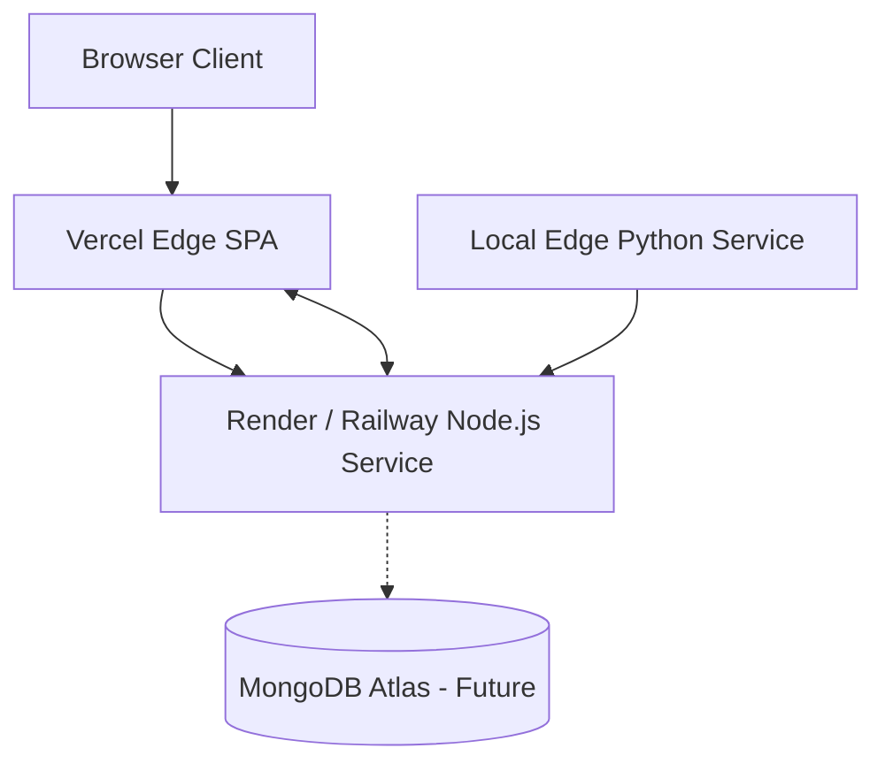

# JunctionIQ

## Adaptive Urban Traffic Signal Optimization using Computer Vision

### Turning Traffic Cameras into Intelligent Junctions

---

> [!IMPORTANT]
> **SUBMISSION STATUS: PROPOSED MVP / ROUND 1 TECHNICAL DESIGN**  
> This repository is a technical proposal and architectural specification submitted for Round 1 of the hackathon. It contains **system architecture, data contracts, and engineering documentation only**. It does not contain application implementation source code, which will be developed in subsequent hackathon rounds.
> 
> *JunctionIQ is a conceptual system. It is not currently deployed in any municipality, does not connect directly to physical traffic infrastructure, and its operational validation is conducted via controlled digital twin simulation.*

---

## Navigation & Document Index

| Category | Document Link | Description |
| :--- | :--- | :--- |
| **Problem & Solution** | [Problem Understanding](file:///docs/01-problem-understanding.md) | Deep analysis of fixed-time signals, queues, and idle delay |
| | [Proposed Solution](file:///docs/02-proposed-solution.md) | End-to-end vision-to-simulation operational workflow |
| **System Architecture**| [System Architecture](file:///docs/03-system-architecture.md) | Comprehensive 8-layer architecture and failure recovery |
| | [High-Level Architecture](file:///architecture/high-level-architecture.md) | System topology and subsystem boundaries |
| | [Backend Architecture](file:///architecture/backend-architecture.md) | Request lifecycle, controllers, and services design |
| | [AI Perception Pipeline](file:///architecture/ai-pipeline.md) | YOLO vehicle detection and lane ROI geometric mapping |
| | [Database Architecture](file:///architecture/database-architecture.md) | ER diagrams and future MongoDB persistence design |
| | [API Request Flow](file:///architecture/api-flow.md) | REST request sequence and validation gates |
| | [Real-Time WebSocket Flow](file:///architecture/realtime-flow.md) | Socket.io event topology and room subscriptions |
| | [Deployment Topology](file:///architecture/deployment-architecture.md) | Edge-to-cloud deployment progression |
| **Engineering Specs** | [Technology Stack](file:///docs/04-technology-stack.md) | Detailed technology choices and trade-off rationale |
| | [Backend Approach](file:///docs/05-backend-approach.md) | Node.js/Express design and modular folder layout |
| | [Database Design](file:///docs/06-database-design.md) | In-memory state and future collections specification |
| | [API Documentation](file:///docs/07-api-documentation.md) | Complete REST endpoints and WebSocket event catalog |
| | [Automation Opportunities](file:///docs/08-automation-opportunities.md) | Closed-loop optimization and CI/CD automation |
| | [AI Integration](file:///docs/09-ai-integration.md) | Perception pipeline, bounds, and non-AI optimizer |
| | [Scalability & Deployment](file:///docs/10-scalability-and-deployment.md) | Three-stage scaling model from single junction to city |
| | [Security & Privacy](file:///docs/11-security.md) | Video data minimization, TLS, and perimeter defense |
| **Scope & Validation** | [MVP Scope Definition](file:///docs/12-mvp-scope.md) | Explicit in-scope vs. out-of-scope boundaries |
| | [Future Scope Roadmap](file:///docs/13-future-scope.md) | Multi-junction coordination and RL research roadmap |
| | [Validation Strategy](file:///docs/14-validation-strategy.md) | Controlled fixed vs. adaptive simulation benchmarks |
| **Data Contracts** | [Traffic State Schema](file:///schemas/traffic-state-schema.json) | JSON Schema contract for vision telemetry |
| | [Signal Plan Schema](file:///schemas/signal-plan-schema.json) | JSON Schema contract for phase timing plans |
| | [Simulation Result Schema](file:///schemas/simulation-result-schema.json) | JSON Schema contract for comparative benchmark deltas |
| | [API Envelope Schema](file:///schemas/api-response-schema.json) | Standardized REST response wrapper schema |
| **Data Examples** | [Traffic State Example](file:///examples/traffic-state-example.json) | Realistic four-way telemetry JSON instance |
| | [Signal Plan Example](file:///examples/signal-plan-example.json) | Realistic adaptive signal schedule JSON instance |
| | [Simulation Result Example](file:///examples/simulation-result-example.json) | Illustrative comparative simulation benchmark JSON |

---

## 1. Project Overview

**JunctionIQ** is a proposed software intelligence platform that turns existing municipal traffic-camera feeds into real-time adaptive traffic signals. By deploying deep learning computer vision models on optical video feeds, JunctionIQ continuously measures vehicle counts, lane-wise spatial density, and standing queue depths at an intersection.

Using these spatial telemetry inputs, JunctionIQ computes deterministic, mathematically bounded signal timing allocations that favor heavily congested approaches while enforcing strict safety floors. The platform validates these adaptive recommendations inside a controlled digital twin simulation engine, comparing performance against static fixed-time baselines before streaming live telemetry and comparative metrics to an operator dashboard.

---

## 2. Problem Statement

Urban traffic demand is inherently dynamic, shifting unpredictably between morning commutes, evening rushes, and localized surges. However, the vast majority of physical traffic signals still operate on rigid **fixed-time control plans** (e.g. allocating equal 30-second green intervals to all approaches regardless of actual demand).

```text
Lane A (North): 32 vehicles waiting  ──> Allocated: 30 seconds green  [Queue spillover / cycle failure]
Lane B (South):  7 vehicles waiting  ──> Allocated: 30 seconds green  [Green wasted on empty asphalt]
Lane C (East):  11 vehicles waiting  ──> Allocated: 30 seconds green  [Underutilized phase]
Lane D (West):  26 vehicles waiting  ──> Allocated: 30 seconds green  [Growing standing queue]
```

This structural mismatch causes:
- **Unnecessary Delay:** Drivers sit idling on minor approaches while major approaches clear in a fraction of their allocated green time.
- **Cascading Queue Buildup:** Persistent queues spill past approach bays, blocking upstream intersections.
- **Excess Fuel Consumption & Emissions:** Extended vehicle idling wastes fuel and elevates urban carbon emissions.

---

## 3. Proposed Solution

JunctionIQ bridges this gap through a closed-loop intelligence architecture:

$$\text{Traffic Camera} \longrightarrow \text{Computer Vision} \longrightarrow \text{Traffic State} \longrightarrow \text{Adaptive Optimization} \longrightarrow \text{Traffic Simulation} \longrightarrow \text{Dashboard}$$

1. **Optical Video Ingestion:** Ingests live RTSP feeds from pre-existing junction cameras without requiring in-pavement inductive loops.
2. **Deep Learning Perception:** YOLO object detection classifies vehicles, and geometric polygon ROI mapping attributes them to discrete lane approaches.
3. **Normalized Traffic State:** Compiles lane vehicle counts, spatial densities ($0.0 - 1.0$), and standing queue lengths into a structured JSON payload.
4. **Deterministic Optimization:** An explainable, rule-based scoring engine calculates proportional green splits bounded by strict safety minimums ($\ge 10\text{s}$) and maximums ($\le 75\text{s}$).
5. **Digital Twin Simulation:** Simulates identical traffic arrivals under fixed-time vs. adaptive timing regimes to evaluate efficiency gains.
6. **Real-Time Presentation:** Streams live metrics, signal phase states, and comparative deltas to an operator dashboard via WebSockets.

---

## 4. Key Platform Features

- **Vehicle Detection & Classification:** Real-time identification of passenger cars, buses, commercial trucks, and two-wheelers.
- **Lane-Wise Spatial Counting:** Dynamic association of vehicle tire contact points with polygon approach zones.
- **Traffic Density Estimation:** Normalized road occupancy calculation reflecting physical road capacity.
- **Queue Depth Estimation:** Kinematic tracking identifying stationary vehicles waiting at red signals.
- **Deterministic Adaptive Optimization:** Bounded arithmetic demand scoring prioritizing high-demand corridors without black-box unpredictability.
- **Fixed vs. Adaptive Twin Simulation:** Controlled discrete-event simulation proving comparative efficiency under identical synthetic traffic streams.
- **Comparative Performance Analytics:** Instant quantification of waiting time reduction, queue clearance, and throughput gains.
- **Live Real-Time Dashboard:** Low-latency visual monitoring of active junction states, active signal countdowns, and performance charts.

---

## 5. System Architecture

The following diagram illustrates the high-level information flow across the system:


*For complete architectural specifications, see [System Architecture Specification](file:///docs/03-system-architecture.md) and [High-Level Architecture](file:///architecture/high-level-architecture.md).*

---

## 6. Proposed Technology Stack

| Layer | Proposed Technology | Architectural Purpose |
| :--- | :--- | :--- |
| **Frontend Framework** | React 18+, TypeScript, Vite | Interactive Single Page Application |
| **UI & Styling** | TailwindCSS, shadcn/ui | Modern, responsive, accessible interface design |
| **Data Visualization** | Recharts | SVG-based comparative metrics and queue graphing |
| **Backend Runtime** | Node.js, Express, TypeScript | High-throughput async REST API and service coordinator |
| **Real-Time Transport** | Socket.io / WebSockets | Low-latency bi-directional state and metrics broadcasting |
| **Computer Vision** | Python 3.10+, OpenCV | Video decoding, geometric ROI masking, and ray-casting |
| **Object Detection** | YOLO (v8/v10) | High-speed vehicle detection and classification |
| **Data Persistence (MVP)** | In-Memory Stores & Static JSON | Zero-latency, zero-overhead state management for single junction |
| **Data Persistence (Future)**| MongoDB Atlas | Durable time-series telemetry and historical audit archive |
| **Frontend Deployment** | Vercel Edge Network | Global CDN distribution for static web assets |
| **Backend Deployment** | Render / Railway | Cloud container execution with automated SSL |
| **Vision Deployment** | Edge Workstation / Jetson | Localized inference close to optical sensor |

*For complete tooling justifications, see [Technology Stack Rationale](file:///docs/04-technology-stack.md).*

---

## 7. Backend Architectural Approach

The proposed backend utilizes a layered service-controller architecture written in TypeScript:
- **`controllers/`**: Extracts parameters and packages responses using a standardized `ApiResponseEnvelope`.
- **`routes/`**: Binds URL paths and schema validation middleware.
- **`services/`**: Implements core business logic—traffic snapshot management, deterministic signal timing calculations, and simulation execution.
- **`middleware/`**: Enforces strict JSON Schema validation, rate limiting, and centralized error logging.
- **`models/`**: Defines strict compile-time TypeScript type definitions mirroring published JSON Schemas.

*For complete backend details, see [Backend Approach Design](file:///docs/05-backend-approach.md).*

---

## 8. Database & Data Architecture

- **MVP Phase:** Transient, high-throughput in-memory collections (`Map<IntersectionId, TrafficState>`) and rolling circular buffers storing the trailing 120 snapshots for immediate dashboard querying.
- **Future Phase:** MongoDB document datastore designed with five normalized collections:
  1. `intersections`: Topography, lane capacities, and physical safety barriers.
  2. `traffic_snapshots`: High-frequency time-series telemetry indexed with TTL auto-expiration.
  3. `signal_plans`: Historical audit log of generated adaptive timing splits.
  4. `simulation_runs`: Benchmark execution records.
  5. `metrics`: Comparative performance indicators.

*For schema definitions and ER diagrams, see [Database Architecture Design](file:///docs/06-database-design.md) and [Database Architecture](file:///architecture/database-architecture.md).*

---

## 9. Proposed API Specifications

### REST Endpoints
- `GET /api/health` — Service readiness and memory diagnostics.
- `GET /api/intersections` — Lists all monitored intersection nodes.
- `GET /api/intersections/:id` — Detailed topography, lanes, and safety parameters.
- `POST /api/traffic/state` — Ingests live lane vehicle counts, densities, and queues.
- `GET /api/traffic/state/:intersectionId` — Retrieves latest cached traffic snapshot.
- `POST /api/optimization/run` — Manually triggers signal recalculation.
- `GET /api/signals/:intersectionId` — Retrieves active signal plan and remaining green seconds.
- `POST /api/simulation/run` — Initiates comparative fixed vs. adaptive benchmark simulation.
- `GET /api/simulation/:id` — Checks simulation execution status.
- `GET /api/metrics/:simulationId` — Retrieves comparative performance deltas.

### Real-Time WebSocket Events
- `traffic:update` — Emitted when vision node ingests new lane telemetry.
- `signal:update` — Emitted when adaptive optimization recalculates phase splits.
- `simulation:update` — Emitted during discrete simulation execution progress.
- `metrics:update` — Emitted when comparative simulation deltas finish computing.

*For complete endpoint contracts and payloads, see [API Specification](file:///docs/07-api-documentation.md).*

---

## 10. Automation Opportunities

- **MVP Automation:**
  1. *Closed-Loop Ingestion & Re-timing:* Vision frame $\to$ YOLO detection $\to$ lane state $\to$ automatic adaptive phase re-calculation.
  2. *Automated Twin Simulation:* Instant dual-arm simulation (fixed vs. adaptive) on identical arrival seeds.
  3. *Spillback Alerting:* Automated WebSocket alerts when queue lengths exceed physical lane storage thresholds.
- **Future Automation:**
  1. *Executive Daily Reporting:* Nightly automated generation of municipal congestion reports.
  2. *Historical Telemetry Downsampling:* Automated database rollup archiving raw data into 15-minute moving averages.
  3. *CI/CD Automation:* Automated linting, test suites, and over-the-air container updates to edge nodes.

*For complete details, see [Automation Opportunities](file:///docs/08-automation-opportunities.md).*

---

## 11. AI & Computer Vision Integration

- **Where AI Is Applied:** AI deep learning is strictly isolated to the **Perception Layer** using YOLOv8/v10 for real-time vehicular bounding box detection and classification.
- **Where AI Is NOT Applied:** The **Optimization Engine is NOT a black-box AI model**. It uses an explainable, deterministic mathematical formula:
  $$\text{DemandScore}_L = (0.30 \cdot \text{count}) + (0.40 \cdot \text{queue}) + (0.20 \cdot \text{density}) + (0.10 \cdot \text{priority})$$
- **Physical Limitations Handled:** The architecture explicitly designs mitigations for optical occlusion, inclement weather, nighttime glare, and camera pole vibrations.

*For complete AI specifications, see [AI Integration Specification](file:///docs/09-ai-integration.md).*

---

## 12. Scalability Architecture

The platform follows a three-stage scaling path:
1. **Stage 1 (Single Intersection - MVP):** Single camera feed, local perception node, monolithic Express backend, web dashboard.
2. **Stage 2 (Multi-Intersection Corridor):** Distributed edge nodes streaming JSON over HTTPS, centralized Redis/MongoDB state store, partitioned WebSocket rooms.
3. **Stage 3 (City-Scale Platform):** Roadside hardware accelerators (NVIDIA Jetson) transmitting metadata only, Kafka message streaming, Kubernetes worker clusters, and multi-intersection corridor coordination.

*For complete scaling designs, see [Scalability Strategy & Deployment](file:///docs/10-scalability-and-deployment.md).*

---

## 13. Proposed Deployment Strategy



- **Frontend:** Hosted on **Vercel** for instant global edge caching and zero devops overhead.
- **Backend:** Hosted on **Render or Railway** for managed Node.js container execution.
- **Vision Perception:** Executed on a **local workstation or edge device** close to the video feed, streaming lightweight JSON upstream without incurring cloud video bandwidth costs.

---

## 14. Validation & Comparative Benchmarking

Validation is conducted via a digital twin discrete-event simulation under strictly controlled scientific conditions:

| Parameter | Control Arm (Baseline) | Experimental Arm (JunctionIQ) |
| :--- | :--- | :--- |
| **Traffic Arrival Seed** | Seed #4092 (Identical) | Seed #4092 (Identical) |
| **Vehicular Volume** | 1,400 veh/hr (Identical) | 1,400 veh/hr (Identical) |
| **Simulation Duration** | 1,800 seconds (Identical) | 1,800 seconds (Identical) |
| **Signal Timing Plan** | **Fixed-Time (Uniform 30s)** | **Adaptive Rule-Based Allocation** |

### Projected MVP Validation (Illustrative Synthetic Example)

> [!WARNING]
> **ILLUSTRATIVE SIMULATION EXAMPLE — FINAL VALUES DEPEND ON IMPLEMENTATION**

| Metric | Fixed Baseline | Adaptive Allocation | Delta (%) | Status |
| :--- | :--- | :--- | :--- | :--- |
| **Average Wait Time** | 72.4 sec | 43.1 sec | **-40.47%** | *ILLUSTRATIVE SIMULATION EXAMPLE* |
| **Average Queue Length** | 31.2 veh | 18.5 veh | **-40.71%** | *ILLUSTRATIVE SIMULATION EXAMPLE* |
| **Throughput** | 840 veh/hr | 1,120 veh/hr | **+33.33%** | *ILLUSTRATIVE SIMULATION EXAMPLE* |
| **Total Engine Idle Time** | 48,200 veh-sec | 29,100 veh-sec | **-39.63%** | *ILLUSTRATIVE SIMULATION EXAMPLE* |

*For complete experimental methodology, see [Validation Strategy](file:///docs/14-validation-strategy.md).*

---

## 15. MVP Scope vs. Future Roadmap

| Capability | Current MVP Status | Future Roadmap Target |
| :--- | :--- | :--- |
| **Junction Geometry** | Single 4-way intersection | Multi-intersection arterial corridor ("Green Wave") |
| **Signal Control** | Advisory recommendations & simulation | Physical controller cabinet integration (NEMA TS2 / NTCIP) |
| **Perception Scope** | Vehicle detection & tracking | Emergency vehicle preemption & pedestrian crosswalk sensing |
| **Optimization Method** | Deterministic rule-based heuristic | Deep reinforcement learning research (SUMO / PPO) |
| **Persistence** | In-memory cache & static JSON | MongoDB Atlas time-series database & historical data lake |
| **Infrastructure** | Standalone Node.js & Python services | Containerized edge deployment (Docker / TensorRT) |

*For complete scope boundaries, see [MVP Scope Definition](file:///docs/12-mvp-scope.md) and [Future Scope Roadmap](file:///docs/13-future-scope.md).*

---

## 16. Submission Status & Technical Honesty

- **Project Status:** **ROUND 1 TECHNICAL PROPOSAL & ARCHITECTURE DESIGN**
- **Hardware Integration:** The current MVP does not actuate physical traffic lights.
- **Municipal Deployment:** The project has not been deployed on public roadways.
- **AI Classification:** Optimization is deterministic arithmetic; reinforcement learning is strictly future research.
- **Metrics Presentation:** All numerical benchmark results are explicitly labeled as illustrative simulation examples.

---

## 17. License

This project proposal and documentation are released under the [MIT License](file:///LICENSE).
