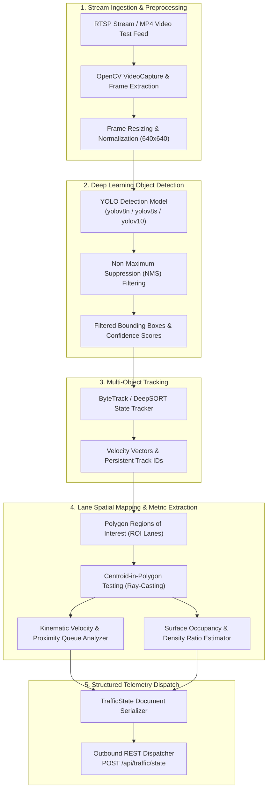

# Computer Vision & AI Pipeline Architecture

## 1. Perception Subsystem Mission

The Computer Vision subsystem converts unstructured, raw optical traffic camera feeds into normalized, structured spatial telemetry. It answers four fundamental questions in real time:
1. **Presence:** How many vehicles occupy the junction approaches?
2. **Classification:** What vehicle categories (passenger cars, buses, heavy trucks, two-wheelers) are present?
3. **Spatial Distribution:** Which specific lane approach (e.g., Northbound Lane A vs. Westbound Lane D) does each vehicle belong to?
4. **Kinematic State:** Is a vehicle actively queued/stationary or traveling at normal approach speed?

---

## 2. End-to-End Vision Pipeline

---

## 3. Technology Selection Justification

### 3.1 Why YOLO (You Only Look Once)?
- **Real-Time Single-Stage Inference:** Operates on full frames in a single forward pass, providing high frame rates (30+ FPS on edge GPU hardware like NVIDIA Jetson or 15–20 FPS on modern multi-core x86 CPUs).
- **Pretrained Weights for Road Transport:** COCO pretrained weights inherently detect categories `car`, `bus`, `truck`, and `motorcycle` out of the box with zero fine-tuning required for initial MVP validation.
- **Quantization Compatibility:** Readily exportable to ONNX, TensorRT, or OpenVINO formats for low-latency edge deployment.

### 3.2 Why OpenCV?
- **Universal Hardware Decoding:** Efficiently binds to system hardware codecs, supporting RTSP, H.264/H.265 RTSP streams, and local test video files.
- **Vector Geometric Calculations:** Provides native, optimized functions for polygon point containment (`pointPolygonTest`), matrix affine transformations, and perspective corrections.

---

## 4. Telemetry Extraction Methodology

### 4.1 Lane Mapping via Polygon ROIs (Regions of Interest)
Each lane approach is configured as a 2D convex polygon mapped against the camera's fixed perspective. When a bounding box is generated:
$$\text{Centroid} = \left( x_{\min} + \frac{w}{2}, y_{\min} + h \right)$$
*(Note: Centroid y-coordinate is anchored to the bottom edge of the bounding box to match the road contact point of the tires).*

A ray-casting algorithm evaluates which lane polygon contains the contact centroid, assigning the vehicle uniquely to that lane index.

### 4.2 Queue Length Estimation
Vehicles assigned to an approach are classified as **queued** if:
1. Average speed over a trailing 3-second window drops below a threshold (e.g., $v \le 5\text{ km/h}$).
2. Distance to the intersection stop-line or the preceding queued vehicle is within close proximity.
3. The current signal phase for that lane is red or transitional yellow.

### 4.3 Traffic Density Calculation
Density ($\rho_L$) represents the spatial saturation of a lane approach, evaluated as:
$$\rho_L = \min\left(1.0, \frac{\sum_{i=1}^{N_L} \text{PCE}_i \times \text{Area}_{\text{std}}}{\text{LaneCapacity}_{\text{max}}}\right)$$
Where $\text{PCE}$ is Passenger Car Equivalent (Car = 1.0, Bus = 2.5, Truck = 2.0, Motorcycle = 0.5).

---

## 5. Vision Pipeline Limitations & Engineering Realities

| Operational Challenge | Real-World Impact | Proposed Mitigation in Architecture |
| :--- | :--- | :--- |
| **Perspective Occlusion** | Large buses or trucks obscure compact passenger cars or two-wheelers behind them. | Temporal tracking (ByteTrack) maintains lost tracks across brief occlusion intervals (30–60 frames). |
| **Adverse Weather / Rain / Glare** | Water droplets or headlight reflections cause false positive detections. | Dynamic confidence thresholding ($\ge 0.50$), non-maximum suppression (NMS) tuning, and frame averaging. |
| **Nighttime / Poor Illumination** | Low signal-to-noise ratio in optical sensors degrades edge definitions. | Contrast Limited Adaptive Histogram Equalization (CLAHE) preprocessing; future integration with thermal/infrared feeds. |
| **Camera Vibrations / Wind** | Pole sway shifts static ROI polygon boundaries relative to lane stripes. | Boundary margin buffers around lane polygons; future scope includes OpenCV feature-point background stabilization. |

---

## 6. Clear Demarcation: AI vs. Deterministic Optimization

> [!IMPORTANT]
> In the JunctionIQ architecture, **Artificial Intelligence and Deep Learning are strictly bounded to the Computer Vision Perception Layer** (vehicle detection and classification).
> 
> The **Signal Optimization Engine is completely deterministic and rule-based**. It does NOT use black-box Machine Learning or Reinforcement Learning (RL) in the MVP. Reinforcement learning is strictly classified as a future research topic.
