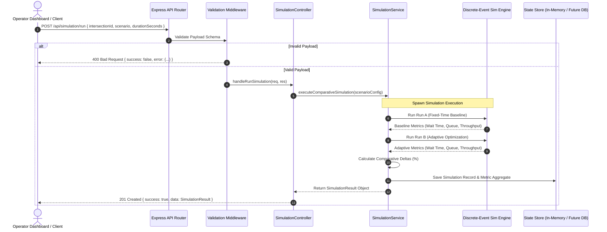
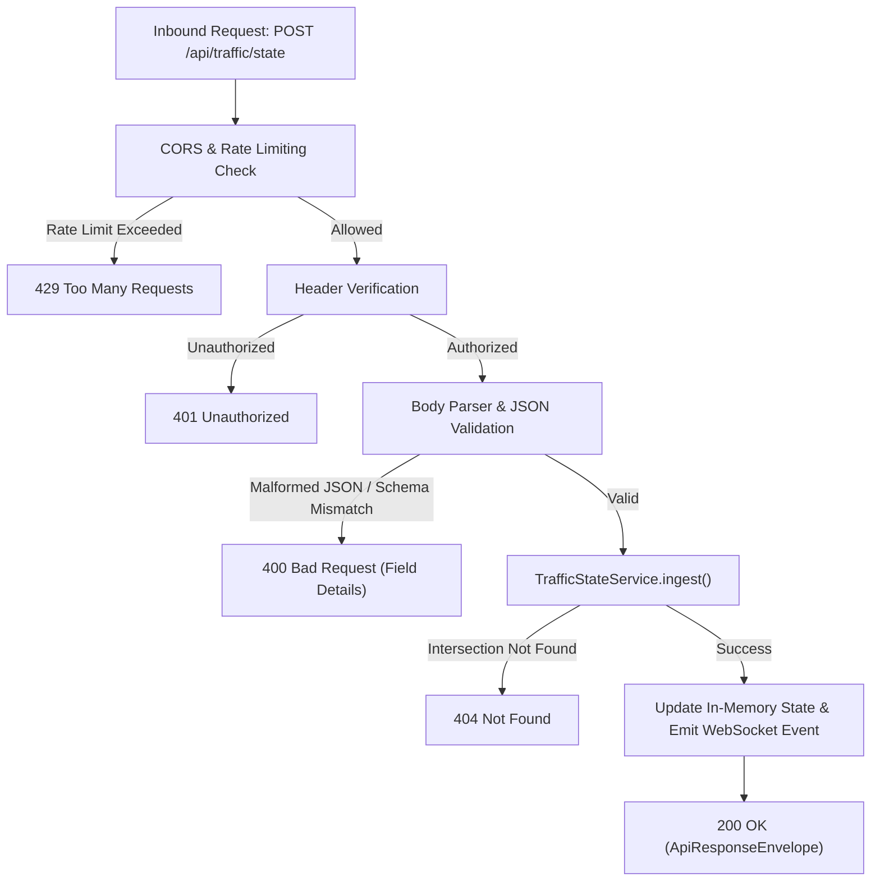

# API Request Flow Architecture

## 1. REST API Architecture Overview

The JunctionIQ REST API exposes endpoints grouped into five functional controllers:
1. **System & Health:** Health checks, runtime metadata, uptime.
2. **Intersection Configuration:** Topology details, lane limits, phase barriers.
3. **Traffic Ingestion & Telemetry:** Ingestion of camera observations, querying recent snapshots.
4. **Signal Optimization:** Manual or event-triggered calculation of adaptive signal timing.
5. **Simulation & Validation:** Execution of comparative discrete-event simulations and retrieval of benchmark metrics.

All responses are packaged within a standardized `ApiResponseEnvelope`.

---

## 2. Global REST Endpoint Directory

| Method | Endpoint | Primary Consumer | Purpose |
| :--- | :--- | :--- | :--- |
| `GET` | `/api/health` | Monitoring / Keep-Alive | Returns process health, uptime, and memory usage |
| `GET` | `/api/intersections` | React Dashboard | Lists all registered junction nodes |
| `GET` | `/api/intersections/:id` | React Dashboard | Returns lane configuration and constraints for a junction |
| `POST` | `/api/traffic/state` | Python Vision Service | Ingests real-time lane vehicle counts, density, and queues |
| `GET` | `/api/traffic/state/:intersectionId` | React Dashboard | Retrieves latest cached traffic snapshot |
| `POST` | `/api/optimization/run` | Dashboard / Cron Job | Manually triggers signal plan recalculation |
| `GET` | `/api/signals/:intersectionId` | Dashboard / Operators | Retrieves active and proposed signal plan |
| `POST` | `/api/simulation/run` | Dashboard / Researchers | Triggers comparative simulation run (Fixed vs. Adaptive) |
| `GET` | `/api/simulation/:id` | React Dashboard | Checks simulation execution status |
| `GET` | `/api/metrics/:simulationId` | React Dashboard | Returns comparative performance metrics & deltas |

---

## 3. End-to-End Simulation Request Flow

The following sequence illustrates how a client triggers a comparative benchmark simulation to evaluate adaptive signal logic against a fixed-time baseline:

---

## 4. State Ingestion & Exception Flow

The diagram below details the defensive error-handling pipeline applied during vision telemetry ingestion:

