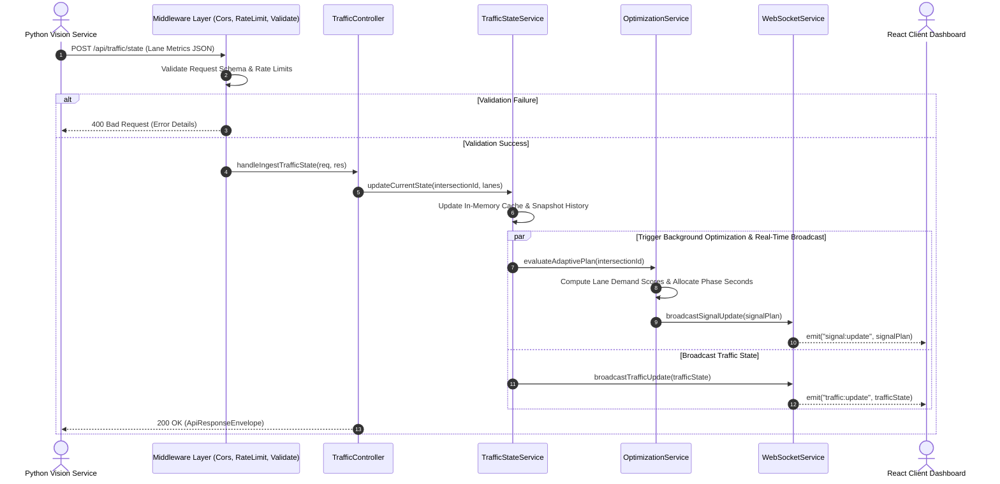

# Backend Architecture Design

## 1. Architectural Strategy

The JunctionIQ backend is proposed as a modular, lightweight service built on **Node.js, Express, and TypeScript**. It acts as the central orchestration hub that coordinates telemetry ingestion from computer vision nodes, executes deterministic signal optimization logic, triggers benchmark simulations, and broadcasts real-time state changes to connected web clients via WebSockets.

---

## 2. Proposed Source Structure

The proposed backend design adopts a layered service-repository-controller architectural pattern to enforce separation of concerns and maintain testability:

```text
backend/
├── src/
│   ├── config/             # Environment, threshold limits, and baseline signal configs
│   │   ├── env.config.ts
│   │   └── intersection.config.ts
│   ├── controllers/        # HTTP route handler logic & parameter extraction
│   │   ├── health.controller.ts
│   │   ├── intersection.controller.ts
│   │   ├── traffic.controller.ts
│   │   ├── optimization.controller.ts
│   │   └── simulation.controller.ts
│   ├── routes/             # REST route path definitions and middleware bindings
│   │   ├── api.router.ts
│   │   ├── traffic.routes.ts
│   │   ├── optimization.routes.ts
│   │   └── simulation.routes.ts
│   ├── services/           # Core domain logic, business rules, & orchestrators
│   │   ├── traffic-state.service.ts
│   │   ├── optimization.service.ts
│   │   ├── simulation.service.ts
│   │   └── websocket.service.ts
│   ├── middleware/         # Cross-cutting filters (validation, errors, security)
│   │   ├── validate.middleware.ts
│   │   ├── error.middleware.ts
│   │   ├── rate-limit.middleware.ts
│   │   └── logging.middleware.ts
│   ├── models/             # Domain entity type contracts & in-memory stores
│   │   ├── traffic.types.ts
│   │   ├── signal-plan.types.ts
│   │   └── simulation.types.ts
│   ├── utils/              # Pure mathematical helpers, log formatters, math utilities
│   │   ├── logger.ts
│   │   └── scoring-formula.ts
│   └── app.ts              # Express application factory & WebSocket server setup
└── tsconfig.json           # (Design contract only)
```

---

## 3. Component Responsibility Matrix

| Subsystem / Folder | Architectural Responsibility |
| :--- | :--- |
| `controllers/` | Ingests parsed HTTP requests, unpacks validated route parameters, delegates business logic to relevant domain services, and formats standard API responses using the `ApiResponseEnvelope`. |
| `routes/` | Declares URL endpoints, version prefixes (`/api/v1/`), and mounts route-specific validation middleware schemas before passing flow to controllers. |
| `services/` | Houses core domain rules. Maintains in-memory lane snapshot states, computes lane demand indices, coordinates deterministic phase timing allocations, and manages simulation runs. |
| `middleware/` | Enforces request hygiene: verifies JSON payloads against schemas (e.g. Zod or Joi contracts), limits abuse via IP rate limiters, injects correlation request IDs, and catches unhandled exceptions. |
| `models/` | Provides strict TypeScript interface definitions for entities like `TrafficState`, `IntersectionConfig`, `SignalPlan`, and `SimulationBatch`. In MVP, also implements thread-safe in-memory stores. |
| `utils/` | Isolated utility routines for calculation, normalized timestamp conversions, and structured JSON logging. |
| `config/` | Centralized parameter parsing with runtime validation of environment variables and fixed default timing baselines. |

---

## 4. End-to-End Request Lifecycle

The diagram below details the processing flow of an incoming vehicle observation update (`POST /api/traffic/state`) from the computer vision subsystem through the backend pipeline:



---

## 5. Architectural Cross-Cutting Concerns

### 5.1 In-Memory State Management (MVP)
For the single-junction MVP, persistent disk I/O introduces unnecessary latency and setup overhead. The backend holds an active `Map<IntersectionId, TrafficState>` structure in memory alongside a sliding-window ring buffer of the most recent 120 snapshots (1 hour at 30-second cycles) to satisfy near-term dashboard telemetry queries.

### 5.2 Deterministic Signal Optimization Coordination
When a traffic update triggers an optimization cycle, the `OptimizationService` evaluates current lane demand deterministically. Minimum green barriers (e.g., 10s-12s) and maximum constraints (e.g., 60s-75s) are applied as strict guardrails before a `SignalPlan` is produced.

### 5.3 Centralized Error Handling & Response Normalization
All unhandled domain exceptions or validation rejections bubble up to a unified Express error-handling middleware. Responses consistently adhere to the defined `api-response-schema.json` format, preventing leaking of internal stack traces to clients.

### 5.4 Non-Blocking Event-Driven Communication
WebSocket connections managed via Socket.io publish lane updates, phase shifts, and simulation milestones asynchronously. Telemetry distribution runs in the Node.js event loop without stalling incoming HTTP ingestion threads.
