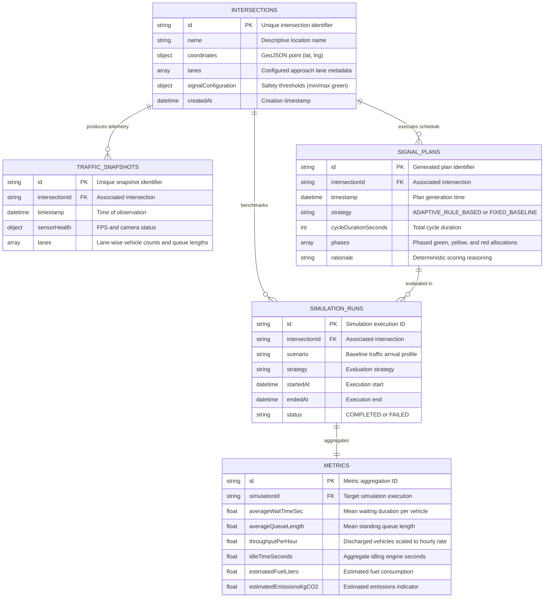

# Database & Data Architecture Design

## 1. Storage Strategy & Architecture Progression

JunctionIQ adopts an evolutionary storage roadmap tailored for rapid individual prototyping while preserving a production-grade data model:

1. **Current MVP Phase (In-Memory & JSON Data Layer):**
   - Active intersection configurations, current traffic states, and generated signal plans reside in memory (`Map` collections in Node.js).
   - Rolling sliding-window buffers hold recent history for immediate live dashboard consumption.
   - Scenario files and baseline configurations are stored as version-controlled static JSON documents.

2. **Future Production Phase (MongoDB Document Store):**
   - High-throughput, flexible document store optimized for time-series geospatial traffic telemetry, historical audit logs, and benchmark archives.

---

## 2. Future Entity-Relationship Data Model

The following diagram defines the schema entities and conceptual relationships planned for the future persistence layer:



---

## 3. Future Collection Specifications

### 3.1 `intersections`
Contains structural geography and physical configuration limits.
```json
{
  "_id": "intersection-01",
  "name": "Grand Ave & 4th Street",
  "location": {
    "type": "Point",
    "coordinates": [-118.2437, 34.0522]
  },
  "lanes": [
    { "laneId": "A", "direction": "NORTH", "capacity": 40, "weight": 1.0 },
    { "laneId": "B", "direction": "SOUTH", "capacity": 40, "weight": 1.0 },
    { "laneId": "C", "direction": "EAST", "capacity": 40, "weight": 1.0 },
    { "laneId": "D", "direction": "WEST", "capacity": 40, "weight": 1.0 }
  ],
  "signalConfiguration": {
    "minGreenSeconds": 10,
    "maxGreenSeconds": 75,
    "yellowSeconds": 4,
    "allRedSeconds": 2,
    "defaultCycleSeconds": 120
  },
  "createdAt": "2026-09-26T00:00:00.000Z"
}
```

### 3.2 `traffic_snapshots`
Time-series capture emitted every 1–5 seconds by vision inference nodes.
```json
{
  "_id": "snap-65001a",
  "intersectionId": "intersection-01",
  "timestamp": "2026-09-26T09:30:00.000Z",
  "lanes": [
    { "laneId": "A", "vehicleCount": 32, "density": 0.78, "queueLength": 18 },
    { "laneId": "B", "vehicleCount": 7, "density": 0.22, "queueLength": 3 },
    { "laneId": "C", "vehicleCount": 11, "density": 0.35, "queueLength": 6 },
    { "laneId": "D", "vehicleCount": 26, "density": 0.69, "queueLength": 14 }
  ]
}
```

---

## 4. Indexing & Data Lifecycle Management Strategy

To ensure sub-millisecond query performance as high-frequency telemetry accumulates, the following future indexing and retention policies are designed:

### 4.1 Indexing Strategy
- **`traffic_snapshots`:**
  - Compound Index: `{ "intersectionId": 1, "timestamp": -1 }` (Enables rapid slicing of the latest time window).
  - Time-To-Live (TTL) Index: `{ "timestamp": 1 }` with `expireAfterSeconds: 604800` (7 days automated garbage collection for raw telemetry).
- **`signal_plans`:**
  - Compound Index: `{ "intersectionId": 1, "timestamp": -1 }`
- **`simulation_runs`:**
  - Compound Index: `{ "intersectionId": 1, "status": 1, "startedAt": -1 }`

### 4.2 Data Rollup and Historical Analytics
Raw telemetry (snapshots every 2–5 seconds) is downsampled after 24 hours into 15-minute statistical buckets (min, max, average queue, peak density) to prevent unbounded disk growth while preserving seasonal analytics.
