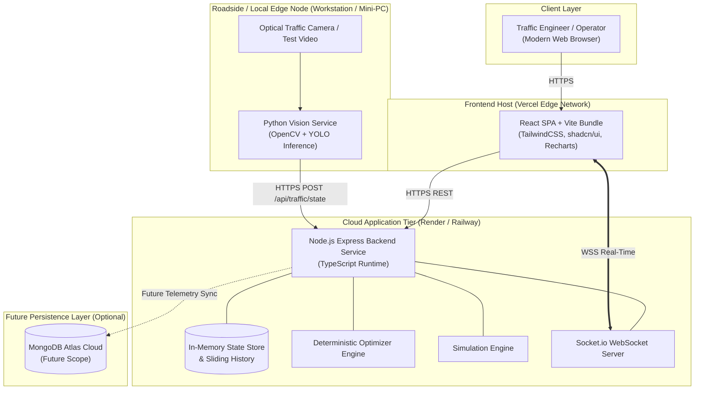

# Deployment & Infrastructure Architecture

## 1. Deployment Philosophy

JunctionIQ prioritizes **architectural simplicity, low developer friction, and operational cost efficiency** for its initial MVP while maintaining a clear upgrade path toward city-scale municipal deployment.

> [!NOTE]
> All deployment architectures described in this document represent **proposed technical strategies**. The MVP does not require Kubernetes, Kafka, or multi-cloud orchestrators.

---

## 2. Proposed MVP Topology (Stage 1)

---

## 3. Evolutionary Scalability Roadmap

### Stage 1: Single Intersection MVP (Current Focus)
- **Deployment Footprint:**
  - **Frontend:** Static SPA deployed to Vercel global edge CDN with zero server maintenance.
  - **Backend:** Single-instance Node.js container hosted on Render or Railway with automatic SSL termination.
  - **Vision Service:** Python inference script executing locally on a developer workstation or an edge-capable device (e.g., NVIDIA Jetson or laptop with CPU/GPU) streaming telemetry upstream via standard HTTP POST.
- **Data Persistence:** Transient in-memory collections and static JSON configuration files.

### Stage 2: Multi-Intersection Aggregation (Medium-Term Target)
- **Deployment Footprint:**
  - Multiple distributed roadside edge nodes each monitoring a distinct junction.
  - Central backend scales vertically or runs dual instances behind an Application Load Balancer with sticky sessions for Socket.io.
  - Integration of MongoDB Atlas for durable event logging and cross-junction comparative analytics.

### Stage 3: City-Scale Platform (Long-Term Vision)
- **Deployment Footprint:**
  - **Edge Processing Tier:** Roadside edge accelerators running containerized lightweight vision models (YOLO ONNX/TensorRT).
  - **Ingestion & Messaging:** High-throughput event streaming (e.g. Apache Kafka or RabbitMQ) decoupling physical ingestion from analytics.
  - **Container Orchestration:** Kubernetes (EKS/GKE) clusters orchestrating stateless API workers and asynchronous simulation workers.
  - **Geospatial & Time-Series Data Lake:** Tiered storage for multi-year historical trend modeling and predictive arrival analysis.

---

## 4. Proposed Host Environment Specifications

| Service | Proposed Host / Platform | Resource Allocation (MVP) | Scaling Dimension |
| :--- | :--- | :--- | :--- |
| **Frontend UI** | Vercel Edge Network | Edge Serverless CDN | Global automatic autoscaling |
| **Node.js Backend** | Render / Railway Web Service | 1 vCPU, 1 GB RAM | Vertical compute sizing |
| **Vision Inference** | Local Edge Machine / Jetson Orin | 4-Core CPU + Optional GPU (4GB+ VRAM) | Horizontal: 1 edge unit per junction |
| **Data Storage** | In-Memory (MVP) $\to$ MongoDB Atlas | Shared Tier (M0/M10 for future) | Storage volume + read replicas |
