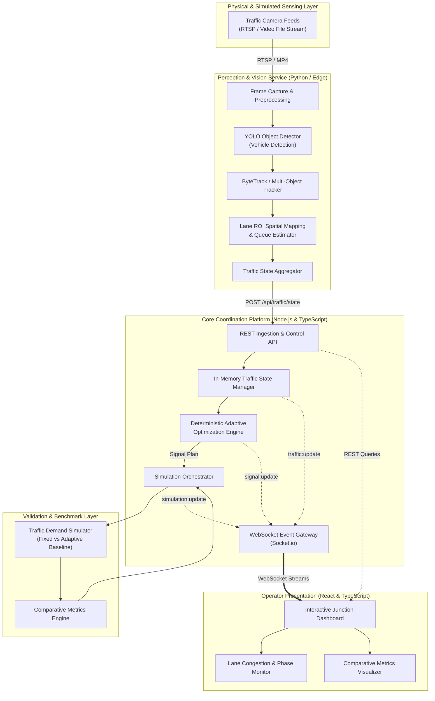

# High-Level System Architecture

## 1. Architectural Overview

JunctionIQ is designed as a modular, decoupled software intelligence platform for urban intersections. The platform transforms existing roadside optical sensors (CCTV / IP traffic cameras) into structured digital telemetry, computes adaptive signal timings deterministically, and validates timing strategies within a controlled simulation loop before projecting operational insights to an operator dashboard.

The architecture strictly separates:
- **Perception Layer (Python Vision Service):** High-throughput video frame ingestion, neural vehicle inference, vehicle tracking, and lane spatial association.
- **Coordination & Intelligence Layer (Node.js/Express Backend):** Ingests normalized traffic state, executes deterministic timing heuristics, coordinates simulation runs, and manages real-time broadcast channels.
- **Simulation Layer (In-Engine Discrete-Event Simulator):** Clones identical arrival queues under fixed versus adaptive timing regimes to calculate comparative efficiency indicators.
- **Presentation Layer (React Dashboard):** Visualizes intersection status, live queues, time allocation deltas, and telemetry trends.

---

## 2. End-to-End System Topology

---

## 3. Subsystem Breakdown and Responsibilities

| Subsystem | Core Responsibilities | Technology Stack | Communication Mode |
| :--- | :--- | :--- | :--- |
| **Vision Service** | Ingest video stream, detect vehicular bounding boxes, track identities across frames, project centroids onto lane polygons, calculate density and queue depth. | Python 3.10+, OpenCV, YOLOv8/v10 (CPU/CUDA) | Outbound HTTP POST to Backend (`/api/traffic/state`) |
| **Backend Core** | Central state holding, request validation, executing signal allocation rules, orchestrating simulation runs, handling client sessions. | Node.js, Express, TypeScript | Inbound REST API, Outbound WebSockets |
| **Optimization Engine** | Evaluate lane demand scores using weighted count, queue, and density; produce constrained green phase allocations respecting safe minimums and maximums. | Deterministic TypeScript Algorithm | Synchronous Internal Service Call |
| **Simulation Engine** | Run synthetic traffic arrival batches under identical randomized seeds comparing standard fixed cycles vs adaptive signal allocations. | Discrete-Event Queue Engine (JS/TS) | In-process or Worker Thread invocation |
| **Frontend Portal** | Render four-way junction state, active light phases, queue indicators, and comparative performance deltas. | React 18+, Vite, TailwindCSS, shadcn/ui, Recharts | Socket.io Client & Axios REST Client |

---

## 4. Key Architectural Design Principles

1. **Strict Decoupling of Perception and Optimization:**  
   The vision pipeline operates autonomously as an upstream telemetry producer. The backend does not care whether state arrives from a live physical camera or a synthetic pre-recorded video stream, as long as it adheres to the `TrafficState` JSON contract.

2. **Deterministic & Explainable Decision-Making:**  
   Unlike black-box reinforcement learning models that pose unpredictable safety boundary behaviors, the MVP optimization engine utilizes bounded arithmetic scoring. Every millisecond of green light allocated can be traced to verifiable lane telemetry.

3. **Software-Only Safety Isolation:**  
   The system never directly manipulates physical signal controller hardware (NEMA TS2 or 2070 cabinets). All outputs are published as recommendations and tested through simulated digital twins.

4. **Lean Resource Footprint for Individual Maintainability:**  
   The system deliberately avoids complex distributed message brokers (e.g., Kafka) or cluster orchestrators (e.g., Kubernetes) for the MVP, allowing seamless execution on standard workstations or lightweight cloud instances.
