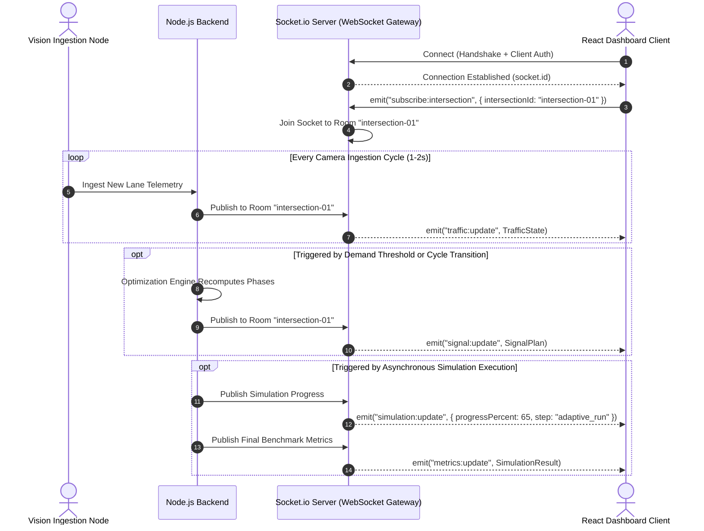
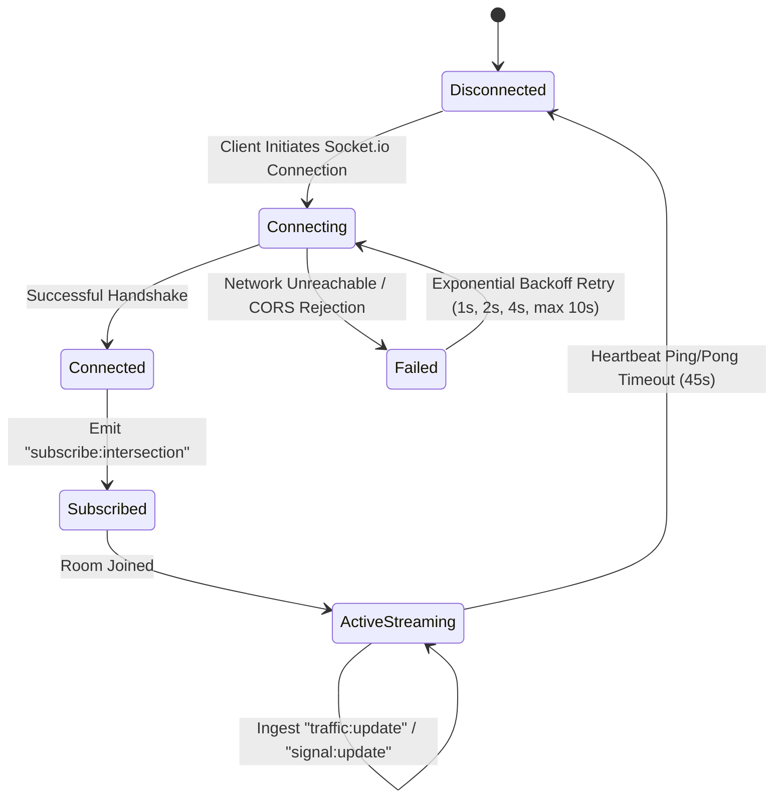

# Real-Time WebSocket Architecture

## 1. Real-Time Communication Strategy

Urban traffic management requires low-latency, bi-directional telemetry streams. While configuration queries and manual interventions use REST endpoints, continuous telemetry and live signal updates are driven by **WebSockets via Socket.io**.

### 1.1 Architectural Advantages
- **Elimination of Polling:** Prevents client polling storms against the Node.js event loop.
- **Selective Room Subscriptions:** Clients join rooms scoped to specific junctions (`intersection:intersection-01`), receiving only relevant telemetry.
- **Graceful Fallback:** Socket.io provides automatic fallback to HTTP long-polling in restrictive enterprise network or firewall environments.

---

## 2. Event Topology and Data Flow

---

## 3. WebSocket Event Catalog

| Event Name | Direction | Trigger Condition | Payload Summary |
| :--- | :--- | :--- | :--- |
| `subscribe:intersection` | Client $\to$ Server | Dashboard mounts junction view | `{ "intersectionId": "intersection-01" }` |
| `traffic:update` | Server $\to$ Client | Vision node submits new lane detection data | Full `TrafficState` object including lane counts, densities, and queue depths |
| `signal:update` | Server $\to$ Client | Optimizer generates new adaptive phase allocation | Full `SignalPlan` object including active phase index, remaining green seconds |
| `simulation:update` | Server $\to$ Client | Discrete-event simulation completes a milestone step | `{ "simulationId": string, "progress": number, "currentPhase": string }` |
| `metrics:update` | Server $\to$ Client | Simulation run completes and comparative deltas finish computing | Full `SimulationResult` object with comparative deltas |

---

## 4. Connection Lifecycle & Resilience Design

### 4.1 Resilience Safeguards
1. **Heartbeat Monitoring:** Default 25-second ping interval with a 20-second timeout to promptly tear down stale TCP sockets.
2. **Exponential Backoff:** Clients reconnect with randomized jitter to prevent thundering herd scenarios upon backend restarts.
3. **Room Isolation:** Operators viewing Junction A receive zero network traffic from Junction B, ensuring client scalability.
