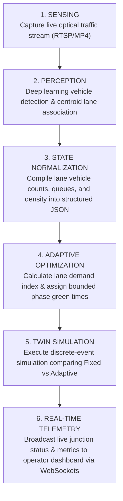
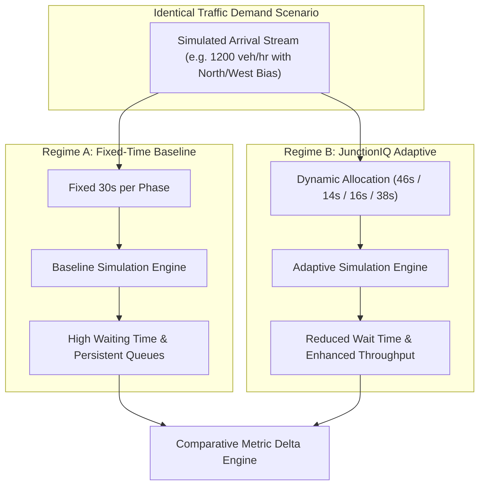

# Proposed Solution: JunctionIQ

## 1. Solution Overview

**JunctionIQ** is a software intelligence platform that transforms existing municipal traffic cameras into adaptive signal timing optimization systems. By extracting real-time lane spatial telemetry using computer vision and applying deterministic demand scoring, JunctionIQ dynamically generates optimal signal schedules and validates them via digital twin simulation before surfacing actionable insights on an operator dashboard.

---

## 2. Core Workflow: The Pipeline of Intelligence

The platform processes information through a discrete, decoupled six-stage pipeline:

---

## 3. Subsystem Breakdown

### 3.1 Input Layer
- Ingests standard video streams (RTSP IP camera feeds, HTTP/HLS streams, or offline MP4 surveillance test clips).
- Decoupled from physical hardware; runs independently of camera brands, resolution, or mount heights.

### 3.2 Computer Vision Layer
- Utilizes YOLO deep learning models for high-frame-rate object detection across four primary vehicle classes: cars, buses, trucks, and two-wheelers.
- Applies polygon region-of-interest (ROI) masking to associate vehicle tire contact points with specific directional lanes.
- Measures kinematic movement vectors via multi-object tracking (ByteTrack) to differentiate between moving traffic and stationary queued vehicles.

### 3.3 Traffic State Representation
- Aggregates frame-by-frame inferences into an atomic, normalized JSON snapshot representing the junction at time $t$.
- Contains lane-specific counts, estimated saturation densities (0.0 to 1.0), standing queue lengths, and sensor health metrics.

### 3.4 Adaptive Optimization Engine
- Uses an explainable, deterministic mathematical scoring formula to rank lane urgency.
- Calculates green phase splits that prioritize approaches with severe queue buildup while strictly enforcing minimum pedestrian/safety green times ($\ge 10\text{s}$) and maximum duration caps ($\le 75\text{s}$).

### 3.5 Validation Simulation Layer
- Simulates vehicular arrivals in a discrete-event digital twin.
- Executes identical synthetic arrival streams under two parallel regimes:
  1. **Fixed-Time Baseline:** Uniform 30s/30s/30s/30s signal rotation.
  2. **Adaptive Signal Plan:** Dynamically weighted green phase allocations.
- Computes empirical deltas across waiting time, queue clearance, and total throughput.

### 3.6 Real-Time Operator Dashboard
- Built with React, TypeScript, TailwindCSS, and shadcn/ui.
- Renders live lane heatmaps, current active signal phase countdowns, real-time queue graphs, and comparative efficiency metrics.

---

## 4. Fixed vs. Adaptive Comparison Model

The platform directly demonstrates the efficiency gains of demand-responsive timing:

---

## 5. Why Software-Only Architecture?

1. **Zero Infrastructure Civil Works:** Cities do not need to tear up pavement or deploy expensive inductive loops.
2. **Instant Deployment & Scalability:** Software updates and algorithm refinements deploy through standard CI/CD without disrupting physical traffic.
3. **Safety & Regulatory Compliance:** Physical signal controllers handle life-safety fail-safes (conflict monitors, red-lock interlocks). By operating as an advisory and simulation platform, JunctionIQ eliminates the regulatory risks associated with direct hardware intervention during the MVP phase.
4. **Hardware Agnostic:** Ingests any standard RTSP camera feed regardless of manufacturer.

---

## 6. MVP Boundaries

| Dimension | In MVP Scope | Out of MVP Scope |
| :--- | :--- | :--- |
| **Junction Geometry** | One isolated 4-way intersection | Grid or arterial multi-junction coordination |
| **Perception** | Vehicle detection, tracking, lane mapping | Pedestrian facial recognition, license plate reading |
| **Optimization** | Deterministic arithmetic rule-based | Deep reinforcement learning, genetic algorithms |
| **Execution** | Digital twin simulation validation | Physical traffic cabinet wiring (NEMA/Type 170) |
