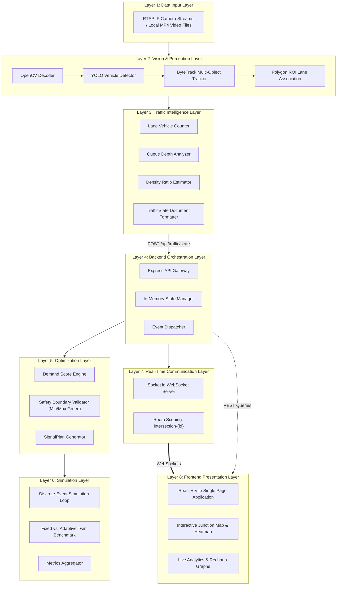
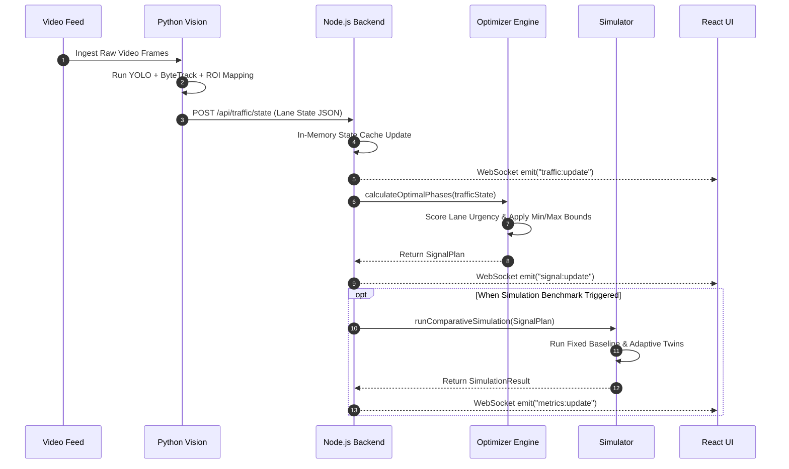
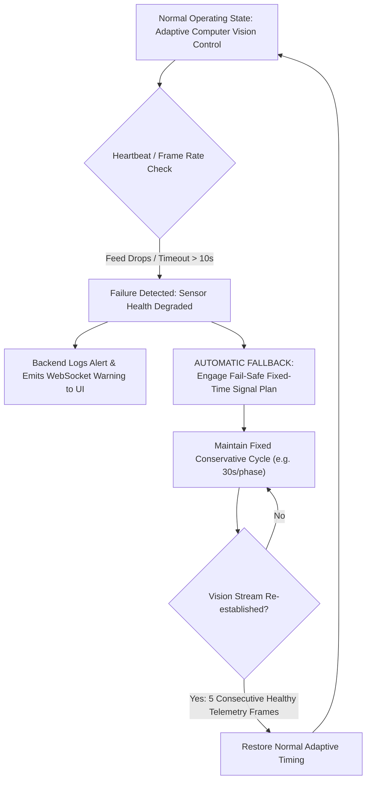

# System Architecture Specification

## 1. Architectural Philosophy

JunctionIQ is engineered around a **decoupled, event-driven, micro-service-ready modular architecture**. Every subsystem is bounded by explicit JSON contracts, ensuring that sensing, intelligence, simulation, and presentation can evolve or scale independently.

---

## 2. The Eight Architectural Layers

---

## 3. Detailed Data Flow & Interaction Diagrams

### 3.1 Service Communication Protocol
The system uses asymmetric transport protocols matched to workload requirements:
- **Vision Node $\to$ Backend:** Asynchronous HTTP/1.1 or HTTP/2 REST `POST` with strict JSON schema validation.
- **Backend $\to$ Simulation Engine:** In-memory synchronous function invocation or Node.js Worker Thread.
- **Backend $\to$ Frontend Dashboard:** Full-duplex WebSocket connection (`Socket.io`) for low-overhead telemetry broadcast.
- **Frontend Dashboard $\to$ Backend:** Standard REST `GET`/`POST` for configuration, ad-hoc simulation triggers, and manual overrides.

### 3.2 Request & Processing Flow

---

## 4. Failure Recovery & Graceful Degradation Flow

Urban civic infrastructure requires resilient failure recovery modes. The following diagram illustrates how JunctionIQ handles camera feed drops, network degradation, or vision node failures:

### 4.1 Safety Fail-Safe Guarantees
- **Timeout Threshold:** If the backend does not receive a valid `TrafficState` payload within 10 seconds, it automatically demotes the junction to a predefined, safe `FIXED_BASELINE` plan.
- **Minimum Green Enforcements:** Even under extreme asymmetric congestion, no green phase can be compressed below 10 seconds, guaranteeing safe pedestrian clearance.
- **Payload Sanity Bounds:** If camera detection reports an implausible vehicle density ($> 1.0$) or negative counts, the middleware drops the packet and maintains the previous valid state.

---

## 5. Architectural Modularity Benefits

1. **Independent Language Runtimes:** Python is leveraged where C++ GPU bindings and deep learning packages excel; TypeScript/Node.js is utilized where high-concurrency event loops and async I/O dominate.
2. **Pluggable Optimizer Engine:** The deterministic rule-based optimizer can be swapped or augmented in future versions (e.g. with linear programming or research models) without modifying the vision service or frontend.
3. **Decoupled Client Interfaces:** Any consumer (web dashboard, municipal API, mobile alert system) can consume standard WebSocket feeds without altering core backend logic.
