# Technology Stack & Tooling Rationale

## 1. Technology Matrix Overview

The JunctionIQ technology stack is chosen to maximize developer velocity, operational reliability, and modular maintainability for an individual engineer during Round 1 while preserving a direct upgrade path to production.

---

## 2. Complete Technology Stack Table

| Architectural Layer | Technology | Status | Core Purpose | Engineering Selection Rationale |
| :--- | :--- | :--- | :--- | :--- |
| **Frontend Framework** | **React 18+** | Proposed MVP | Component-based User Interface | Predictable declarative UI state management, extensive ecosystem, robust developer tooling. |
| **Frontend Language** | **TypeScript** | Proposed MVP | Static Typing for Frontend | Eliminates runtime type errors, ensures strict adherence to API JSON schemas across layers. |
| **Build Tooling** | **Vite** | Proposed MVP | Fast Frontend Dev & Bundler | Instant Hot Module Replacement (HMR), optimized esbuild pre-bundling, rapid production rollup. |
| **CSS Framework** | **TailwindCSS** | Proposed MVP | Utility-first Styling | Rapid interface design without leaving JSX/TSX; small, purge-optimized production CSS footprint. |
| **UI Component Library** | **shadcn/ui** | Proposed MVP | Accessible Design System | Accessible, unstyled Radix UI primitives with copy-paste Tailwind code; clean, modern aesthetic. |
| **Data Visualization** | **Recharts** | Proposed MVP | Charting & Performance Metrics | Declarative, SVG-based charting library seamlessly integrated with React state for dynamic telemetry. |
| **Backend Runtime** | **Node.js** | Proposed MVP | Server-Side Execution Runtime | High-throughput asynchronous non-blocking event loop ideal for handling concurrent telemetry streams. |
| **Backend Framework** | **Express.js** | Proposed MVP | HTTP Routing & REST API Layer | Minimalist, unopinionated, well-understood framework with comprehensive middleware ecosystem. |
| **Backend Language** | **TypeScript** | Proposed MVP | Static Typing for Backend | Shared schema contracts between frontend and backend, autocomplete productivity, strict code quality. |
| **Real-Time Transport** | **Socket.io / WebSockets**| Proposed MVP | Bi-Directional Event Streaming | Low-latency telemetry push to dashboards; automatic fallback to long-polling; built-in room clustering. |
| **Vision Language** | **Python 3.10+** | Proposed MVP | Computer Vision & Inference | Uncontested ecosystem dominance for deep learning, native OpenCV C++ bindings, and rapid prototyping. |
| **Object Detection** | **YOLO (v8/v10)** | Proposed MVP | Real-time Vehicle Detection | Exceptional inference speed-to-accuracy ratio, pre-trained vehicle classes, single-pass pipeline. |
| **Image Processing** | **OpenCV** | Proposed MVP | Frame Capture & Geometry Ops | High-performance video decoding, polygon ROI masking, and ray-casting geometric containment algorithms. |
| **Telemetry Format** | **JSON** | Proposed MVP | Data Serialization Standard | Universal interoperability across Python, Node.js, and web browsers; human-readable and inspectable. |
| **Data Persistence (MVP)**| **In-Memory & JSON** | Proposed MVP | Transient State Management | Zero-latency read/write access, zero infrastructure overhead for single-junction demonstration. |
| **Data Persistence (Future)**| **MongoDB Atlas** | **Future Scope** | Durable Time-Series & Geo Storage | High-throughput document ingestion, GeoJSON queries, native TTL expiration for telemetry pruning. |
| **Frontend Hosting** | **Vercel** | Proposed MVP | Serverless Edge Deployment | Global CDN distribution, automated preview deployments, zero devops overhead for static client assets. |
| **Backend Hosting** | **Render / Railway** | Proposed MVP | Containerized Cloud Hosting | Native Node.js support, automated SSL termination, persistent process uptime without VM management. |
| **Inference Hosting** | **Edge Workstation** | Proposed MVP | Local Perception Service | High FPS execution near video source without incurring expensive cloud GPU egress and ingestion costs. |

---

## 3. Strict Classification: MVP vs. Future Technologies

```mermaid
flowchart LR
    subgraph MVP_TECH["PROPOSED FOR INITIAL MVP"]
        direction TB
        F_MVP["React + Vite + TailwindCSS<br/>shadcn/ui + Recharts"]
        B_MVP["Node.js + Express + TypeScript"]
        V_MVP["Python + YOLO + OpenCV"]
        D_MVP["In-Memory Store + Static JSON"]
        H_MVP["Vercel + Render/Railway + Local Edge"]
    end

    subgraph FUTURE_TECH["FUTURE SCOPE ONLY"]
        direction TB
        DB_FUT["MongoDB Atlas / Time-Series DB"]
        ORCH_FUT["Docker + Kubernetes (K8s)"]
        MSG_FUT["Apache Kafka / RabbitMQ Streams"]
        HW_FUT["NEMA TS2 Hardware Signal Cabinets"]
        RL_FUT["Deep Reinforcement Learning (PPO/DQN)"]
    end

    MVP_TECH -.->|Evolutionary Roadmap| FUTURE_TECH
```

---

## 4. Key Architectural Trade-Offs

### 4.1 Node.js vs. Pure Python Backend
- *Decision:* Python is dedicated exclusively to the Vision Service; Node.js handles the API and coordination.
- *Rationale:* While Python excels at tensor math, Node.js outperforms Python in handling hundreds of concurrent WebSocket client connections and rapid JSON event dispatching without blocking on the Global Interpreter Lock (GIL).

### 4.2 In-Memory State vs. Immediate Database
- *Decision:* In-memory sliding-window maps for MVP; MongoDB deferred to future milestones.
- *Rationale:* Keeps the Round 1 proposal lean and zero-friction. A single junction producing telemetry every 2 seconds does not require database transactions for baseline algorithmic validation.
