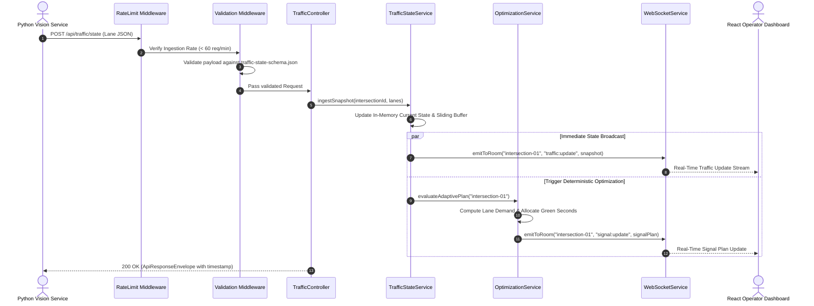

# Backend Architectural Approach & Design

## 1. Architectural Strategy

> [!IMPORTANT]
> This document specifies the **architectural design and engineering conventions** for the proposed JunctionIQ backend. In accordance with Round 1 submission requirements, this is a technical blueprint; executable backend code will be authored in subsequent implementation phases.

The backend acts as the central coordinator of JunctionIQ. It connects asynchronous perception feeds with deterministic optimization logic, coordinates comparative digital simulations, and streams live telemetry to clients.

---

## 2. Proposed Source Code Directory Structure

The proposed structure organizes the backend around strict domain separation:

```text
backend/src/
├── config/
│   ├── env.config.ts             # Validated environment variables (ports, keys)
│   └── signal-defaults.config.ts # Safety limits: min/max green, yellow, all-red
├── controllers/
│   ├── health.controller.ts      # Health probe and runtime metadata handlers
│   ├── intersection.controller.ts# Junction geometry & configuration queries
│   ├── traffic.controller.ts     # Ingestion of lane telemetry and snapshot access
│   ├── optimization.controller.ts# Manual/auto execution of signal optimization
│   └── simulation.controller.ts  # Comparative benchmark execution & retrieval
├── routes/
│   ├── index.ts                  # Central router mounting /api/v1 prefixes
│   ├── traffic.routes.ts         # Routes for traffic telemetry
│   ├── optimization.routes.ts    # Routes for signal computation
│   └── simulation.routes.ts      # Routes for digital twin simulations
├── services/
│   ├── traffic-state.service.ts  # In-memory snapshot caching & history buffers
│   ├── optimization.service.ts   # Deterministic lane scoring & phase calculator
│   ├── simulation.service.ts     # Discrete-event simulation runner & comparator
│   └── websocket.service.ts      # Socket.io room management & broadcast hub
├── middleware/
│   ├── validate.middleware.ts    # Schema validation against JSON specifications
│   ├── error.middleware.ts       # Unified catch-all error handling & formatting
│   ├── rate-limit.middleware.ts  # IP-based rate limiting to prevent API abuse
│   └── logging.middleware.ts     # Structured HTTP access and latency logger
├── models/
│   ├── traffic.types.ts          # TypeScript interfaces for traffic payloads
│   ├── signal.types.ts           # Interfaces for phases, plans, and constraints
│   └── simulation.types.ts       # Interfaces for benchmark runs and deltas
└── utils/
    ├── logger.ts                 # Structured log formatter (info/warn/error)
    └── math-helpers.ts           # Weighted scoring and rounding utilities
```

---

## 3. Subdirectory Responsibility Breakdown

| Directory | Core Responsibility |
| :--- | :--- |
| `config/` | Ensures the application fails fast on startup if mandatory environment variables are missing. Encapsulates fixed physical boundaries (e.g. minimum green duration = 10s). |
| `controllers/` | Acts as the HTTP adapter: decodes query/body parameters, passes calls to domain services, and serializes output into standard response envelopes. Contains zero direct business rules. |
| `routes/` | Declares URL paths, maps HTTP verbs, and mounts specific validation middleware before handing control to controllers. |
| `services/` | Contains the platform's core intellectual property: traffic state aggregation, deterministic demand scoring, green phase distribution, and simulation orchestration. |
| `middleware/` | Intercepts requests prior to controllers to enforce security, input schema validation, CORS permissions, rate limiting, and global error normalization. |
| `models/` | Houses compile-time TypeScript type definitions that mirror the schemas defined in `/schemas/`. |
| `utils/` | Stateless, side-effect-free helper routines for arithmetic normalization and logging. |

---

## 4. Primary Backend Responsibilities

1. **Traffic-State Management:** Ingests high-frequency vehicle telemetry from vision nodes, maintains an active in-memory dictionary of current intersection states, and appends records to a rolling history buffer.
2. **API Layer:** Exposes clean REST endpoints for frontend inspection, external systems, and manual operator overrides.
3. **Optimization Coordination:** Evaluates lane urgency whenever new telemetry arrives or a phase timer expires, issuing mathematically bounded signal recommendations.
4. **Simulation Coordination:** Manages discrete-event twin simulations comparing baseline fixed schedules against adaptive strategies under identical synthetic traffic profiles.
5. **WebSocket Communication:** Manages real-time Socket.io channels, isolating updates to specific junction rooms to prevent extraneous client bandwidth usage.
6. **Defensive Validation & Sanitization:** Guarantees that every inbound JSON payload conforms strictly to defined schemas before passing into domain logic.
7. **Error Isolation & Logging:** Catches asynchronous exceptions, logs structured error contexts, and returns human-readable diagnostic messages without terminating the Node.js event loop.

---

## 5. End-to-End Request Lifecycle: State Ingestion



---

## 6. Conceptual Cross-Cutting Design Decisions

### 6.1 Environment Variable Configuration
- All configuration keys (`PORT`, `NODE_ENV`, `CORS_ORIGIN`, `DEFAULT_MIN_GREEN`) are loaded through a centralized typed configuration service.
- The service will perform startup assertion checks, terminating immediately with a clear error log if any critical configuration is missing or malformed.

### 6.2 Centralized Error Handling Architecture
- All Express controllers wrap asynchronous operations in standard try-catch blocks or use an `asyncHandler` wrapper.
- A global error middleware catches all rejections, categorizes the error (e.g. `ValidationError`, `NotFoundError`, `ConflictError`), logs the stack trace internally, and generates a structured response:
  ```json
  {
    "success": false,
    "timestamp": "2026-09-26T09:31:00.000Z",
    "requestId": "req-98f24a1b",
    "data": null,
    "error": {
      "code": "VALIDATION_FAILED",
      "message": "Field 'density' must be between 0.0 and 1.0",
      "details": ["lanes[0].density: value 1.45 exceeds maximum bound 1.0"]
    }
  }
  ```

### 6.3 Request Validation Strategy
- Inbound request bodies are validated using strict schema validators (such as Zod or Joi) that strictly mirror the project's JSON Schemas.
- Payloads containing unrecognized properties or out-of-bound numerical values are rejected at the middleware boundary before consuming business logic compute cycles.

### 6.4 API Versioning & Route Conventions
- All REST endpoints are prefixed with `/api/v1/` (with a permanent `/api/` rewrite for backward compatibility) to support seamless future protocol evolutions without breaking deployed edge clients.
