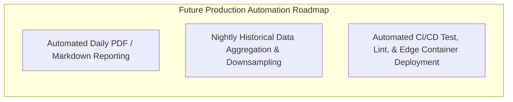

# Automation Opportunities & Engineering Workflows

## 1. Automation Architecture Overview

Automation in JunctionIQ spans operational telemetry loops, algorithmic benchmarking pipelines, and developer lifecycle management. This document categorizes capabilities between **Immediate MVP Automation** and **Future Production Automation**.

---

## 2. Immediate MVP Automation Pipelines

```mermaid
flowchart TD
    subgraph AUTO1["Pipeline 1: Continuous Closed-Loop State & Optimization"]
        V_IN["Video Frame Stream"] --> DET["Autonomous YOLO Detection"]
        DET --> MAP["Automatic Lane ROI Projection"]
        MAP --> STATE["TrafficState Ingestion"]
        STATE --> RE_OPT{"Demand Shift Threshold Exceeded?"}
        RE_OPT -->|Yes| OPT_EXEC["Automatic Adaptive Signal Recalculation"]
        OPT_EXEC --> WS_PUSH["Automatic Real-Time Push to Clients"]
    end

    subgraph AUTO2["Pipeline 2: Automatic Dual-Regime Simulation Comparison"]
        TRIG["Benchmark Execution Trigger"] --> DUAL_FORK["Fork Identical Arrival Seed"]
        DUAL_FORK --> SIM_FIX["Run Fixed-Time Digital Twin"]
        DUAL_FORK --> SIM_ADP["Run Adaptive Digital Twin"]
        SIM_FIX --> DELTA_GEN["Auto-Aggregate Performance Deltas"]
        SIM_ADP --> DELTA_GEN
        DELTA_GEN --> CHART_UPDATE["Auto-Render Comparison Charts"]
    end

    subgraph AUTO3["Pipeline 3: Autonomous Threshold-Based Alerting"]
        MONITOR["Ingestion Stream Monitor"] --> CHECK{"Lane Queue > Max Storage Capacity?"}
        CHECK -->|Yes| WARN["Emit Instant SPILLOVER_ALERT"]
        WARN --> UI_BANNER["Display Warning Banner on Dashboard"]
    end
```

### 2.1 Autonomous Telemetry-to-Optimization Feedback Loop
- **Trigger:** Continuously driven by the vision node processing incoming frames.
- **Workflow:** Vehicle centroids are assigned to lanes; queue depths and densities are calculated. When the aggregate variance of lane demand shifts by more than $15\%$ from the active plan, the backend automatically triggers an optimization run without requiring manual human dispatcher intervention.

### 2.2 Automated Twin Simulation Benchmarking
- **Trigger:** Operator clicks "Run Benchmark" or changes scenario traffic volume.
- **Workflow:** The simulation orchestrator automatically initializes two discrete queues with identical pseudo-random arrival distributions. It executes the baseline fixed plan, then the adaptive plan, calculates percentage deltas, and dispatches the comparative metrics to the dashboard automatically.

### 2.3 Threshold-Based Safety Alerting
- **Trigger:** Monitored lane metrics in the active state store.
- **Workflow:** If a queue length exceeds an approach's configured storage capacity (e.g. queue $> 20$ vehicles on Lane A), the backend generates an automated `SPILLBACK_RISK` warning event across WebSockets, highlighting the congested approach in the user interface.

---

## 3. Future Production Automation Pipelines

### 3.1 Automated Operational Reporting
- **Concept:** At the conclusion of daily traffic operations (e.g. 23:59 UTC), a headless worker executes automated rollup calculations across all daily simulation runs and snapshots, compiling an executive PDF/Markdown summary showing peak congestion windows and overall simulated delay savings.

### 3.2 Scheduled Analytics Downsampling
- **Concept:** A scheduled cron job queries raw MongoDB snapshot records older than 7 days, computes 15-minute moving averages for vehicle counts and throughput, stores these in an aggregated analytics collection, and purges the raw high-frequency records.

### 3.3 Continuous Integration & Edge Deployment (CI/CD)
- **Concept:** Automated Git-triggered pipelines (e.g., GitHub Actions):
  - Ingest code commits $\to$ run linting and unit tests $\to$ bundle frontend for Vercel CDN $\to$ trigger container deployment on backend $\to$ run model quantization test for edge nodes.

---

## 4. Automation Capability Comparison Matrix

| Automation Capability | Pipeline Scope | Implementation Mechanism | Status |
| :--- | :--- | :--- | :--- |
| **Telemetry Ingestion Loop** | Operational | Frame $\to$ Detection $\to$ Ingestion | **Proposed MVP** |
| **Demand-Driven Re-timing** | Algorithmic | State Trigger $\to$ Bounded Optimizer | **Proposed MVP** |
| **Dual-Regime Twin Simulation** | Benchmarking | Identical Seed $\to$ Fixed vs. Adaptive | **Proposed MVP** |
| **Queue Spillover Threshold Alerts** | Safety Monitoring | Condition Check $\to$ WebSocket Broadcast | **Proposed MVP** |
| **Automated Executive Reporting** | Reporting | Cron Job $\to$ Headless Document Generator | **Future Scope** |
| **Historical Data Downsampling** | Database Ops | MongoDB TTL + Scheduled Aggregation | **Future Scope** |
| **Over-The-Air (OTA) Edge Deploy** | DevOps | Container Registry $\to$ Roadside Edge Node | **Future Scope** |
