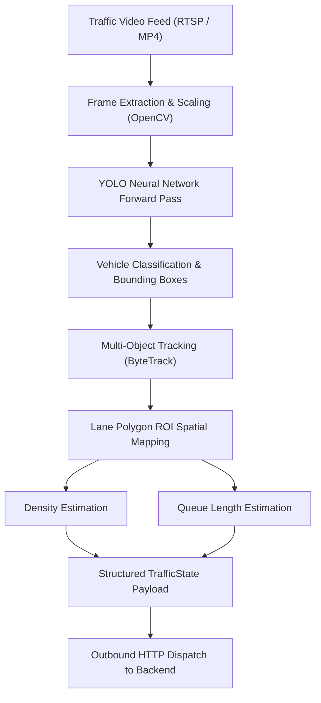
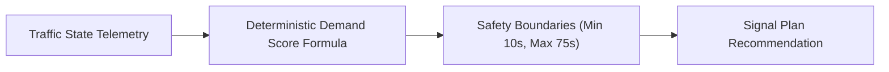

# Artificial Intelligence & Computer Vision Integration

## 1. Precise Scope of AI in JunctionIQ

> [!IMPORTANT]
> In JunctionIQ, **Artificial Intelligence is strictly and exclusively applied to the Computer Vision Perception Layer** (vehicle detection and classification).
> 
> The **Signal Optimization Engine is NOT an AI or machine learning model**—it is a deterministic mathematical algorithm with explicit safety boundaries. Reinforcement learning (RL) is strictly classified as a future research topic and is NOT part of the initial MVP.

---

## 2. The Vision Perception Pipeline

The pipeline transforms unstructured video pixel streams into structured, typed numerical state records:



---

## 3. Technology Rationale

### 3.1 Why YOLO (You Only Look Once)?
- **Inference Speed:** Single-stage detector architecture capable of processing 30+ frames per second on modern hardware, satisfying real-time urban traffic constraints.
- **Built-in Class Support:** Pre-trained COCO checkpoints classify road transport classes (`car`, `bus`, `truck`, `motorcycle`) directly without custom labeling prerequisites for initial MVP validation.
- **Hardware Portability:** Efficiently exports to ONNX or TensorRT runtimes, allowing the perception service to execute on edge devices (such as NVIDIA Jetson or x86 mini-PCs) directly at the intersection.

### 3.2 Why OpenCV?
- **Stream Decoding:** Industrial-grade bindings for RTSP, H.264/H.265 hardware-accelerated video decoding.
- **Polygon Containment:** Highly optimized computational geometry routines for evaluating point-in-polygon containment (`cv2.pointPolygonTest`).

---

## 4. Perception Methodology & Telemetry Extraction

### 4.1 Vehicle Detection & Classification
Input frames are resized to $640 \times 640$ pixels and passed through the YOLO network. Detections with confidence scores below $0.45$ are discarded. Retained bounding boxes are assigned to one of four vehicle classifications:
- `car` (Passenger Car Equivalent weight: 1.0)
- `bus` (PCE weight: 2.5)
- `truck` (PCE weight: 2.0)
- `motorcycle` (PCE weight: 0.5)

### 4.2 Spatial Lane Mapping via Polygon ROIs
Rather than relying on brittle, fixed grid bounding boxes, operators define 4-point or multi-point convex polygons representing each physical approach lane. 

The vehicle's bottom-center bounding box coordinate is computed as:
$$P_{\text{contact}} = \left( x_{\min} + \frac{\text{width}}{2}, \, y_{\min} + \text{height} \right)$$
Using a ray-casting point-in-polygon algorithm, $P_{\text{contact}}$ is evaluated against each lane polygon. If $P_{\text{contact}} \in \text{Polygon}_L$, the vehicle identity is assigned to Lane $L$.

### 4.3 Queue Estimation Logic
A vehicle in Lane $L$ is flagged as **queued** if:
1. Its tracked velocity vector over a 3-second rolling window is below $5\text{ km/h}$.
2. Its distance from the intersection stop-bar or trailing distance behind another stationary vehicle is within standard urban spacing ($\le 6\text{ meters}$).

The total count of vehicles meeting this condition in Lane $L$ forms `queueLength`.

### 4.4 Traffic Density Estimation
Lane density ($\rho_L \in [0.0, 1.0]$) represents approach saturation:
$$\rho_L = \min \left( 1.0, \, \frac{\sum_{i=1}^{N_L} \text{PCE}_i \times \text{Footprint}_{\text{std}}}{\text{LanePhysicalCapacity}} \right)$$

---

## 5. Normalized Output Schema Contract

The vision subsystem outputs the following structured document to the backend:

```json
{
  "intersectionId": "intersection-01",
  "timestamp": "2026-09-26T09:30:00.000Z",
  "sensorHealth": {
    "cameraStatus": "ONLINE",
    "fps": 28.5,
    "frameDropRate": 0.01
  },
  "lanes": [
    {
      "laneId": "A",
      "approachDirection": "NORTH",
      "vehicleCount": 32,
      "density": 0.78,
      "queueLength": 18
    },
    {
      "laneId": "B",
      "approachDirection": "SOUTH",
      "vehicleCount": 7,
      "density": 0.22,
      "queueLength": 3
    },
    {
      "laneId": "C",
      "approachDirection": "EAST",
      "vehicleCount": 11,
      "density": 0.35,
      "queueLength": 6
    },
    {
      "laneId": "D",
      "approachDirection": "WEST",
      "vehicleCount": 26,
      "density": 0.69,
      "queueLength": 14
    }
  ]
}
```

---

## 6. Real-World Computer Vision Limitations & Edge Cases

Computer vision systems in outdoor municipal environments face significant physical limitations. JunctionIQ explicitly recognizes these factors and incorporates defensive software mitigations:

| Real-World Limitation | Impact on Raw Inferences | Defensive Architectural Mitigation |
| :--- | :--- | :--- |
| **Perspective Occlusion** | Tall commercial vehicles (buses, box trucks) block line-of-sight to smaller vehicles behind them. | ByteTrack multi-object tracking maintains object state across temporary track losses (up to 45 frames). |
| **Extreme Weather (Rain / Fog)** | Water droplets on the camera dome or diffuse fog reduce contrast and object edge clarity. | Temporal frame averaging and confidence thresholding; system reports `DEGRADED` health flag if confidence averages fall below 0.50. |
| **Nighttime Headlight Glare** | Headlight flare can create artificial reflections or obscure vehicle body contours. | Contrast-limited adaptive histogram equalization (CLAHE) preprocessing; focus tracking on headlight point pairs. |
| **Camera Sway from Wind** | High-mast camera poles oscillate in heavy winds, shifting lane polygon alignments. | Inclusion of tolerance margin buffers around lane polygon borders; fail-safe fallback to fixed timing if instability persists. |

---

## 7. Deterministic Signal Optimization (Non-AI Engine)

To prevent confusion, the optimization layer is documented here as an explicit contrast to AI:



### Proposed Conceptual Scoring Model:
$$\text{DemandScore}_L = (w_c \cdot \text{vehicleCount}_L) + (w_q \cdot \text{queueLength}_L) + (w_d \cdot \text{density}_L) + (w_p \cdot \text{lanePriority}_L)$$

*Conceptual Default Weights:*
- $w_c = 0.30$ (Vehicle Count)
- $w_q = 0.40$ (Standing Queue Depth)
- $w_d = 0.20$ (Spatial Saturation Density)
- $w_p = 0.10$ (Lane Arterial Priority)

The resulting scores are normalized across conflicting phases to allocate green phase durations proportionally within defined bounds.
