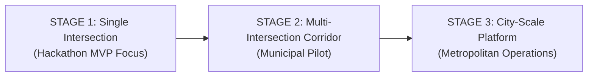
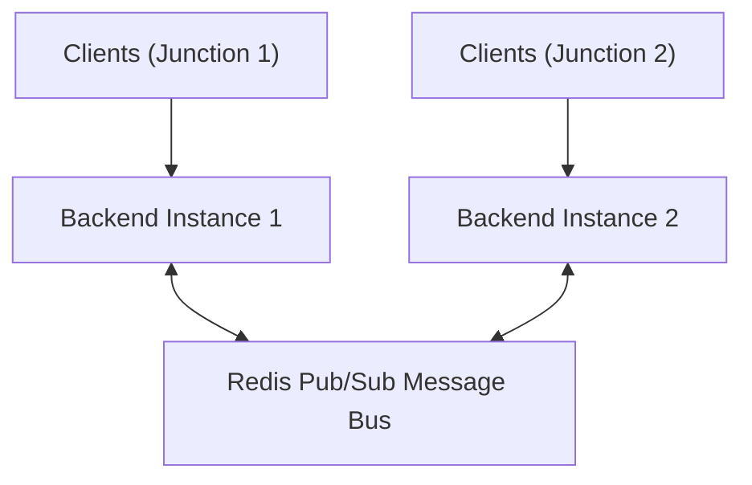
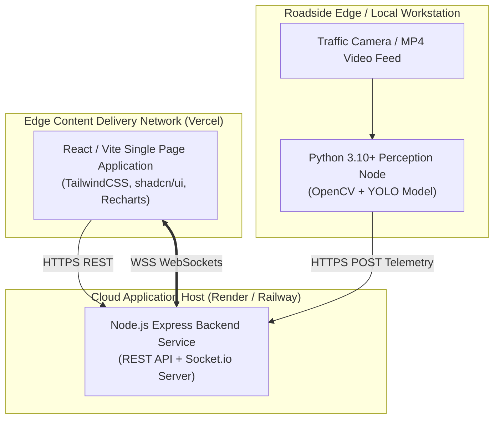

# Scalability Strategy & Deployment Architecture

## 1. Scalability Paradigm: The Three-Stage Evolution

JunctionIQ is engineered to grow smoothly from an individual developer's hackathon prototype to a distributed city-wide traffic intelligence platform.

---

## 2. Stage Breakdown

### Stage 1: Single Intersection (Current MVP Focus)
- **Topology:** One physical or simulated camera feed $\to$ one local Python vision service $\to$ one centralized Node.js/Express backend $\to$ one web-based React dashboard.
- **Data Footprint:** In-memory state collections, static JSON configs, local WebSocket room.
- **Compute Sizing:** Can execute entirely on a single developer workstation or lightweight cloud instance (Render/Railway).

### Stage 2: Multiple Intersections (Municipal Corridor)
- **Topology:** Multiple autonomous vision nodes located at distinct junctions streaming telemetry over secure HTTPS to a horizontally scaled backend cluster.
- **State Partitioning:** In-memory caching replaced by centralized Redis cache or MongoDB instance; WebSocket rooms partitioned per junction (`intersection:{id}`).
- **Corridor Coordination:** Optimization engine evaluates green-wave progression across adjacent intersections.

### Stage 3: City-Scale Platform (Metropolitan Operations)
- **Topology:** Hundreds of distributed roadside edge processing units (NVIDIA Jetson / x86 edge accelerators) extracting telemetry locally to avoid streaming raw high-bandwidth video back to the cloud.
- **Event Streaming:** High-throughput message bus (Apache Kafka or RabbitMQ) ingesting hundreds of thousands of state updates per minute.
- **Container Orchestration:** Microservices orchestrated via Kubernetes (EKS/GKE) with auto-scaling API workers and decoupled simulation analysis engines.

---

## 3. Engineering Scalability Dimensions

### 3.1 Stateless Backend Design
The Node.js Express server is architected to remain stateless. All transient session state or historical sliding buffers can easily transition to an external memory store (e.g., Redis), allowing backend worker instances to be scaled behind a standard cloud load balancer without sticky-session coupling.

### 3.2 WebSocket Scaling via Pub/Sub
In Stage 1, Socket.io manages in-process client connections. For Stage 2 and beyond, scaling across multiple backend nodes is achieved using a Redis-backed Socket.io adapter:

### 3.3 Edge Computing Strategy (Bandwidth Conservation)
Streaming full 1080p 30 FPS video to the cloud consumes ~4–8 Mbps per camera. For a city with 500 intersections, this requires gigabits of continuous network ingress.  
**JunctionIQ's Edge-Native Solution:** Deep learning inference executes directly at the intersection on edge hardware. Only lightweight structured JSON telemetry (~2 KB every 2 seconds) is transmitted upstream, slashing external network bandwidth consumption by over $99.9\%$.

### 3.4 Fault Tolerance & Self-Healing
- **Process Supervisor:** Node.js backend processes are managed via PM2 or platform container supervisors that immediately reboot services upon unhandled crashes.
- **Fail-Safe Signal Mode:** If backend connectivity is interrupted, edge controllers or local advisory displays immediately default to standardized conservative fixed timing.

### 3.5 Monitoring & Observability
- **Application Health:** Endpoint `/api/health` exposes continuous uptime, memory, and active connection gauges.
- **Structured JSON Logging:** Requests, errors, and optimization calculations are output in standardized JSON format for ingestion by centralized logging tools (e.g., Datadog, Prometheus, Grafana).

---

## 4. Proposed Deployment Architecture (MVP)

> [!NOTE]
> The target deployment stack for the MVP is designed for zero infrastructure overhead and rapid iteration. Container orchestrators such as Kubernetes are strictly future considerations.

| Subsystem | Hosting Platform | Runtime Environment | Scaling Mechanism |
| :--- | :--- | :--- | :--- |
| **Frontend Dashboard** | **Vercel** | Serverless Edge CDN | Automated global caching & replication |
| **Backend & Coordinator** | **Render / Railway** | Node.js 18+ Long-Running Process | Vertical RAM/CPU autoscaling |
| **Vision Inference** | **Local Workstation / Edge** | Python 3.10+ with CUDA/MPS/CPU | One instance per physical junction |
| **Data Storage (Future)** | **MongoDB Atlas** | Managed Cloud DB Cluster | Autoscaling storage tiers |
