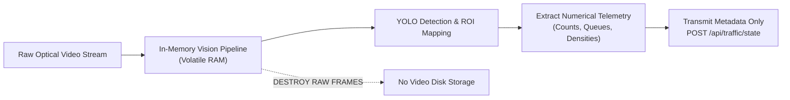

# Security, Privacy & Data Governance Architecture

## 1. Security Philosophy: Defensive Engineering

As a platform designed for potential civic and municipal deployment, JunctionIQ prioritizes data privacy, strict perimeter validation, and minimal attack surface exposure. The architecture treats all incoming network requests—including vision node telemetry—as untrusted inputs.

---

## 2. API Security & Traffic Protection

### 2.1 Transport Layer Security (TLS/HTTPS)
All client-to-backend and vision-to-backend communication is mandated over TLS 1.3 / HTTPS. Unencrypted HTTP traffic is automatically rejected or redirected.

### 2.2 Input Schema Sanitization & Validation
- Every incoming HTTP request body is evaluated against strict JSON Schema contracts at the Express middleware layer before execution reaches business logic.
- Numerical fields (e.g. vehicle counts, density, timestamps) are strictly checked for valid ranges ($0.0 \le \text{density} \le 1.0$, $\text{vehicleCount} \ge 0$).
- Extraneous or unexpected keys in JSON payloads are stripped or rejected to prevent parameter injection attacks.

### 2.3 Rate Limiting & Denial of Service (DoS) Mitigation
- IP-based rate limiters (e.g., `express-rate-limit`) protect public REST endpoints.
- Vision ingestion endpoints (`POST /api/traffic/state`) are throttled to a maximum of 60 requests per minute per junction IP, preventing ingestion floods.
- General dashboard queries are capped to 120 requests per minute per IP.

### 2.4 Cross-Origin Resource Sharing (CORS)
- In development, CORS is configured strictly for local development ports.
- In production, CORS policies restrict inbound origins strictly to the authorized dashboard domain (e.g., `https://junctioniq.vercel.app`), blocking unauthorized third-party browser scripts.

---

## 3. Real-Time WebSocket Security

- **Secure WebSockets (WSS):** All Socket.io streams operate over TLS (`wss://`).
- **Connection Handshake Verification:** During connection initiation, incoming clients can be required to supply an API authorization token or origin check.
- **Room Isolation:** Socket clients are segregated into isolated rooms (`intersection:{id}`). Clients cannot broadcast arbitrary events to other connected clients; all broadcasting is exclusively mediated by the authenticated backend.

---

## 4. Privacy, Video Governance & Data Minimization

Traffic cameras deployed in public urban spaces record public activity, raising legitimate concerns regarding pedestrian privacy, vehicle tracking, and facial recognition.

### 4.1 Zero-Persistent-Video Architecture
- **In-Memory Frame Processing:** Raw video frames captured from RTSP streams reside in volatile RAM only for the duration of model inference (~30 milliseconds) and are immediately discarded from memory.
- **No Video Recording:** The platform does not write raw video, compressed MP4 files, or optical frames to persistent disk storage or cloud storage buckets.
- **Data Minimization Principle:** Upstream communication from the edge vision node to the backend consists purely of anonymized numerical metadata (vehicle count, queue length, density).

### 4.2 Facial Recognition & License Plate Policy
- **No License Plate Recognition (ALPR):** JunctionIQ models do not perform optical character recognition on license plates.
- **No Biometric Surveillance:** The computer vision pipeline classifies coarse vehicular bounding boxes (`car`, `bus`, `truck`, `motorcycle`) and ignores facial biometrics or pedestrian tracking, ensuring civil privacy preservation by design.

---

## 5. Secrets Management & Operational Hygiene

- **Zero Hardcoded Credentials:** All operational parameters, API tokens, and port configurations are ingested strictly via environment variables (`.env`).
- **Audit Trails:** Administrative overrides (e.g., manually forcing a signal recalculation) generate structured audit logs recording client IP, timestamp, and triggered parameter changes.
- **Sanitized Logging:** Logging formatters explicitly strip authorization headers and sensitive tokens before writing logs to stdout or external monitoring providers.

*(Note: The platform is engineered to align with established security best practices; no formal third-party regulatory compliance certifications are claimed for this Round 1 submission).*
