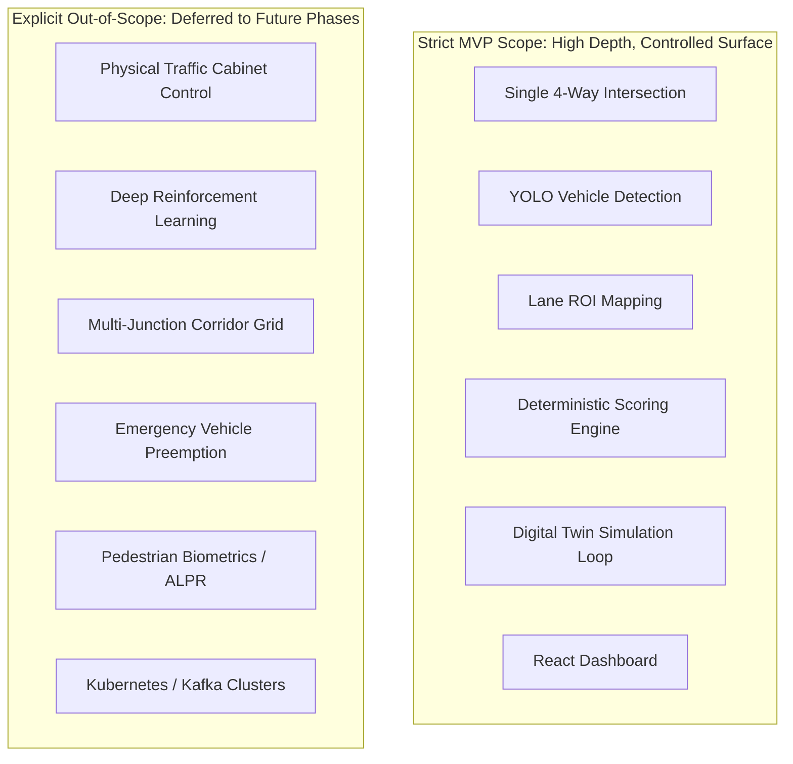

# Minimum Viable Product (MVP) Scope Definition

## 1. Scope Boundary Philosophy

To achieve rigorous technical depth within the constraints of an individual hackathon participant, JunctionIQ establishes strict, unambiguous engineering boundaries. This discipline ensures that the conceptual design is feasible, testable, and demonstrable without diffusing focus across unachievable claims.

---

## 2. In-Scope Capabilities (MVP Definition)

The proposed MVP delivers an end-to-end software pipeline focused on **a single four-way urban intersection**:

| Subsystem | In-Scope Feature | MVP Implementation Boundary |
| :--- | :--- | :--- |
| **Input Ingestion** | Traffic Video Processing | Ingestion of pre-recorded MP4 surveillance feeds or RTSP IP camera streams representing a standard 4-way intersection. |
| **Computer Vision** | Deep Learning Detection | Frame extraction, vehicle object detection using YOLOv8/v10, and multi-object tracking using ByteTrack. |
| **Lane Analysis** | Spatial Classification | Polygon-based Region of Interest (ROI) mapping attributing vehicles to four directional approaches (North, South, East, West). |
| **Telemetry Extraction** | Traffic Indicators | Computation of lane-wise vehicle counts, normalized saturation densities ($0.0 - 1.0$), and standing queue lengths. |
| **Optimization** | Deterministic Signal Timing | Rule-based arithmetic scoring algorithm allocating green-light splits proportional to lane demand. |
| **Safety Guardrails** | Bounded Constraints | Hard minimum green safety floor ($\ge 10\text{ seconds}$) and maximum green ceiling ($\le 75\text{ seconds}$). |
| **Simulation** | Digital Twin Benchmarking | In-engine discrete-event traffic simulation evaluating fixed-time baseline vs. adaptive signal schedules under identical synthetic arrival streams. |
| **Performance Analytics**| Comparative Indicators | Computation of comparative deltas: average waiting delay, queue length, throughput, and estimated idle emissions indicators. |
| **User Interface** | Web Dashboard | React + TypeScript SPA featuring live junction visualization, signal phase indicators, and Recharts telemetry graphs. |
| **API Architecture** | Interface Design | REST API specification with standardized JSON envelopes and bi-directional WebSocket event channels via Socket.io. |

---

## 3. Explicitly Out-of-Scope Capabilities (Non-Goals)

To prevent scope creep and maintain total technical honesty, the following capabilities are **explicitly excluded** from the MVP:

1. **Direct Physical Traffic Cabinet Control:**  
   The MVP does NOT connect to physical traffic signal hardware (e.g. NEMA TS2, Type 170/2070 controller cabinets, or 120V relay switches). All signal timing outputs remain software recommendations validated in simulation.
2. **Municipal / Real-World Public Deployment:**  
   The platform is NOT deployed on public street corners and has no active municipal pilot contracts.
3. **Reinforcement Learning (RL) / Black-Box AI Optimization:**  
   The optimization engine does NOT employ deep Q-networks (DQN) or policy gradient methods. The optimizer is strictly deterministic and rule-based.
4. **Multi-Intersection Network Coordination:**  
   Corridor green-wave synchronization across multiple adjacent intersections is excluded from the initial single-junction prototype.
5. **Emergency Vehicle Preemption & Transit Priority:**  
   Optical or acoustic detection of sirens, emergency vehicles, or transit buses with override privileges is deferred.
6. **Pedestrian Crosswalk & Facial Biometric Tracking:**  
   Pedestrian presence detection and facial recognition are strictly excluded.
7. **Complex Distributed Infrastructure:**  
   Microservice orchestration clusters (Kubernetes), distributed event logs (Apache Kafka), and multi-region database clusters are not required for MVP execution.

---

## 4. Engineering Trade-Off Matrix

By concentrating exclusively on an isolated four-way junction with deterministic optimization and simulation validation, the project delivers an explainable, reliable, and verifiable proof-of-concept.
