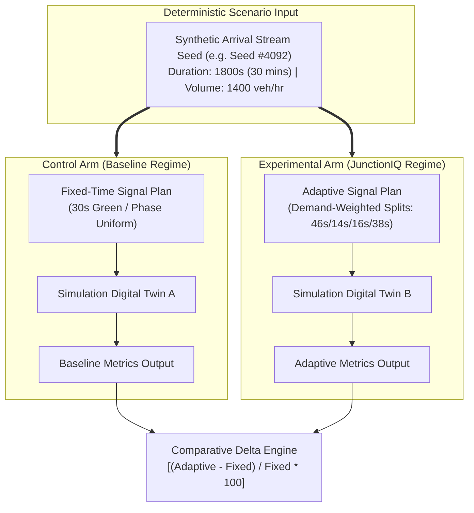

# Validation & Comparative Simulation Strategy

## 1. Validation Philosophy: Controlled Scientific Comparison

Testing adaptive signal algorithms on live public roadways presents immediate public safety hazards, regulatory prohibitions, and unpredictable environmental variables. To ensure rigorous, objective, and repeatable scientific validation, JunctionIQ employs a **digital twin discrete-event traffic simulation methodology**.

The validation core rests on an immutable principle of experimental control:
> **To evaluate the true efficacy of adaptive signal timing, all environmental variables—including traffic arrival patterns, vehicular volumes, driver reaction times, and intersection geometry—must remain 100% identical. The ONLY independent variable that changes between runs is the signal timing strategy.**

---

## 2. Experimental Control Framework

### 2.1 Controlled Variables (Held Strictly Constant)
1. **Vehicular Arrival Seed:** Both simulation runs receive the exact same vehicle generation timestamps, speeds, and directional turn intentions.
2. **Intersection Physical Layout:** Number of lanes, storage bay lengths, and maximum discharge capacities are identical.
3. **Simulation Duration:** Exactly 1800 simulated seconds (30 minutes) per benchmark execution.
4. **Driver Acceleration & Deceleration Parameters:** Reaction times and headway follow identical kinematic constants.

### 2.2 Independent Variable
- **Signal Control Strategy:**
  - *Baseline:* Static fixed-time schedule (e.g., uniform 30 seconds green per approach).
  - *Experimental:* JunctionIQ deterministic demand-adaptive allocation bounded by safety minimums.

---

## 3. Core Evaluation Metrics

| Metric | Measurement Unit | Definition & Relevance |
| :--- | :--- | :--- |
| **Average Waiting Delay** | Seconds / vehicle | Total duration vehicles stand stationary awaiting a green signal before discharging through the stop line. |
| **Average Queue Length** | Number of vehicles | Mean count of stationary queued vehicles accumulated across all approaches per cycle. |
| **Corridor Throughput** | Vehicles / hour | Total volume of vehicles successfully serviced and discharged through the intersection within the simulated time window. |
| **Total Engine Idle Time** | Vehicle-seconds | Cumulative duration all vehicular engines spend in stationary idle mode across the test window. |
| **Estimated Fuel Impact** | Liters of fuel | Projected fuel wasted during stationary idling, derived using standard idle fuel consumption coefficients (~0.6 liters/hour for standard passenger cars). |
| **Estimated $\text{CO}_2$ Indicator** | Kilograms $\text{CO}_2$ | Projected emission footprint derived from idle fuel wastage (~2.31 kg $\text{CO}_2$ emitted per liter of gasoline combusted). |

---

## 4. Illustrative Benchmark Scenario & Comparative Data

> [!WARNING]
> **ILLUSTRATIVE SIMULATION EXAMPLE — FINAL VALUES DEPEND ON IMPLEMENTATION**
> 
> The figures in the table below represent synthetic illustrative test data designed to demonstrate how comparative simulation metrics will be aggregated and displayed. They do NOT represent real-world achieved results or empirical claims.

### Scenario: Morning Peak Asymmetrical Inbound Surge (30-Minute Window)
- **North Approach (Lane A):** Heavy commuter surge (800 veh/hr arrival rate).
- **South Approach (Lane B):** Light counter-flow (180 veh/hr arrival rate).
- **East Approach (Lane C):** Moderate cross-traffic (260 veh/hr arrival rate).
- **West Approach (Lane D):** Moderate-heavy feeder route (620 veh/hr arrival rate).

| Performance Metric | Fixed-Time Baseline | JunctionIQ Adaptive | Comparative Delta | Verification Status |
| :--- | :--- | :--- | :--- | :--- |
| **Average Waiting Time** | 72.4 sec | 43.1 sec | **-40.47%** | *ILLUSTRATIVE SIMULATION EXAMPLE* |
| **Average Queue Length** | 31.2 vehicles | 18.5 vehicles | **-40.71%** | *ILLUSTRATIVE SIMULATION EXAMPLE* |
| **Discharged Throughput** | 840 veh/hr | 1,120 veh/hr | **+33.33%** | *ILLUSTRATIVE SIMULATION EXAMPLE* |
| **Total Cumulative Idle Time** | 48,200 veh-sec | 29,100 veh-sec | **-39.63%** | *ILLUSTRATIVE SIMULATION EXAMPLE* |
| **Estimated Fuel Wastage** | 8.03 Liters | 4.85 Liters | **-39.60%** | *ILLUSTRATIVE SIMULATION EXAMPLE* |
| **Estimated $\text{CO}_2$ Indicator**| 18.55 kg $\text{CO}_2$ | 11.20 kg $\text{CO}_2$ | **-39.62%** | *ILLUSTRATIVE SIMULATION EXAMPLE* |

---

## 5. Why Simulation-Driven Validation Is Scientifically Defensible

1. **Deterministic Reproducibility:** Anyone inspecting the simulation can re-execute the identical random seed and obtain the exact same vehicle arrival events and delta calculations.
2. **Safety Isolation:** Zero physical risk to motorists, pedestrians, or road equipment during testing.
3. **Stress Testing of Corner Cases:** Digital twins allow testing catastrophic failure modes (e.g. 500% sudden traffic spikes, total camera dropouts) that cannot be safely tested on physical roads.
4. **Clean Baseline Attribution:** Because only the signal plan changes between simulation runs, any observed reduction in delay is mathematically attributable to the adaptive timing policy rather than ambient weather or random traffic fluctuations.
